# Задача

> 1.3.1. Построение графиков в Octave
> 1.3.2. Разложение импульсного сигнала в частичный ряд Фурье
> 1.3.3. Определение спектра и параметров сигнала
> 1.3.4. Амплитудная модуляция
> 1.3.5. Кодирование сигнала. Исследование свойства самосинхронизации сигнала

# Выполнение 

## Octave

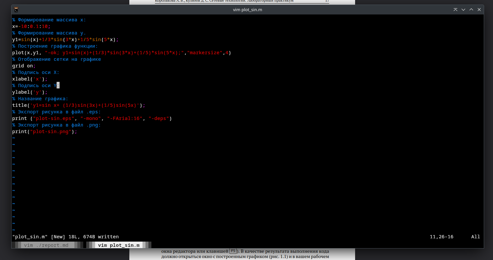

## Отображение графика

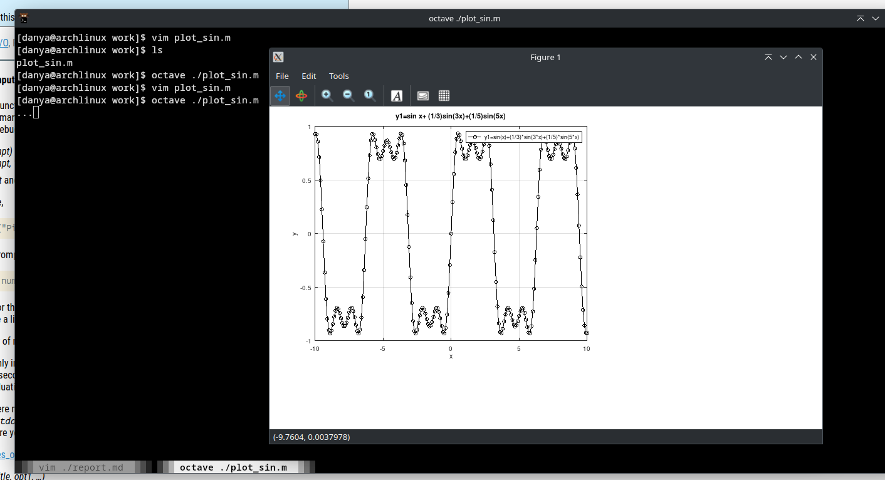

## Несколько графиков на одном рисунке

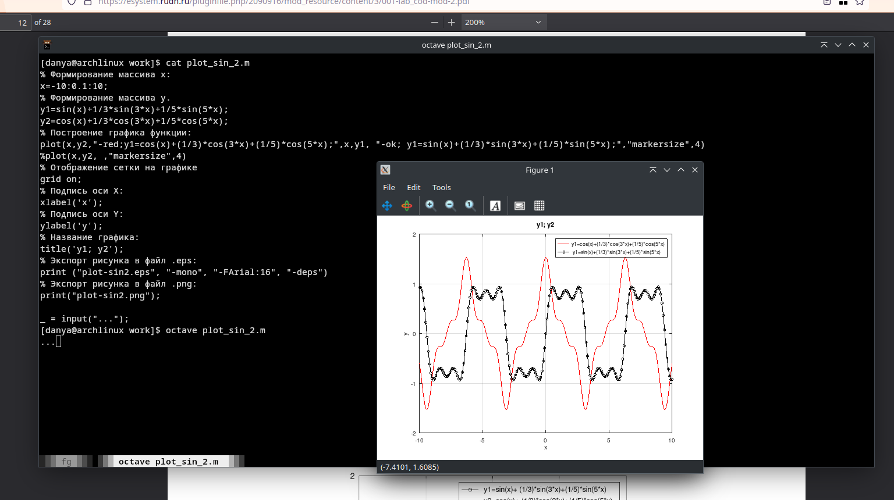

## Меандр / квадратная волна

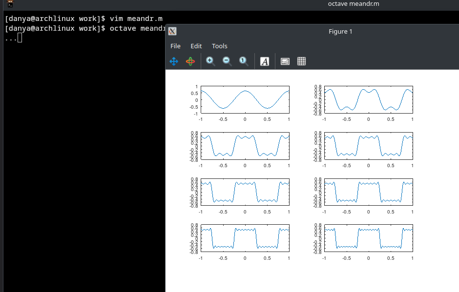

## Квадратная волна через синусы
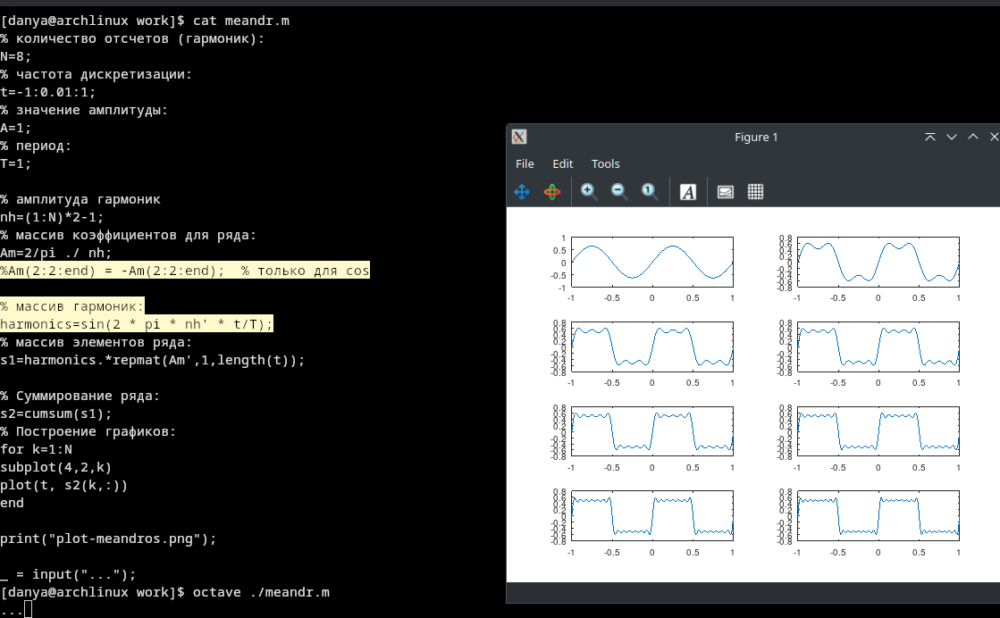

## Преобразование Фурье
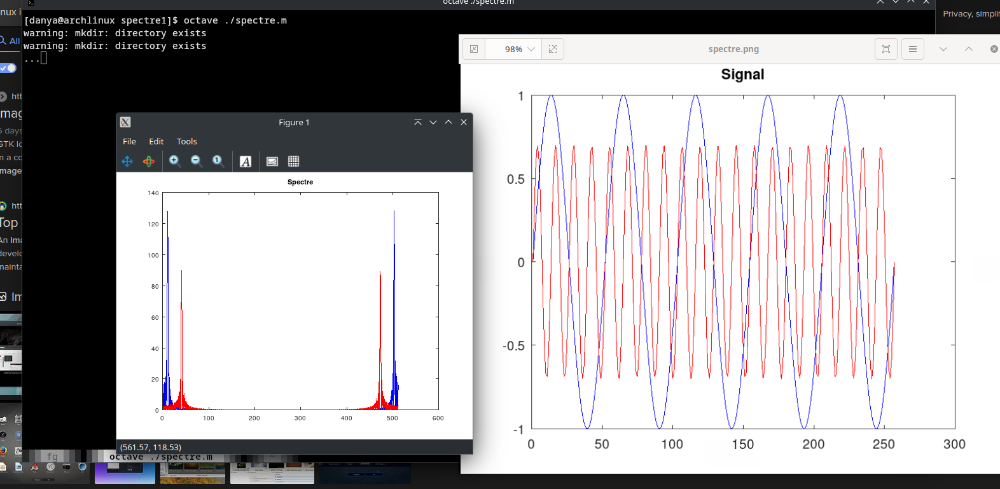

## Исправленное преобразование Фурье
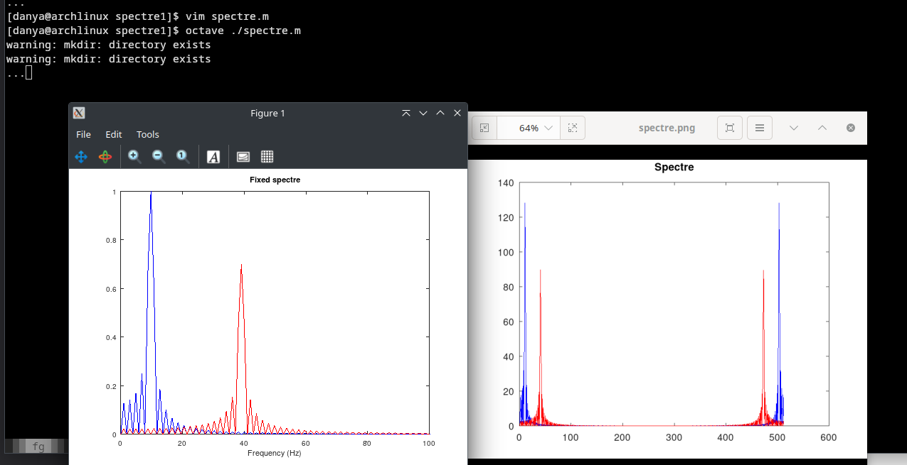

## FFT(a+b) = FFT(a) + FFT(b)
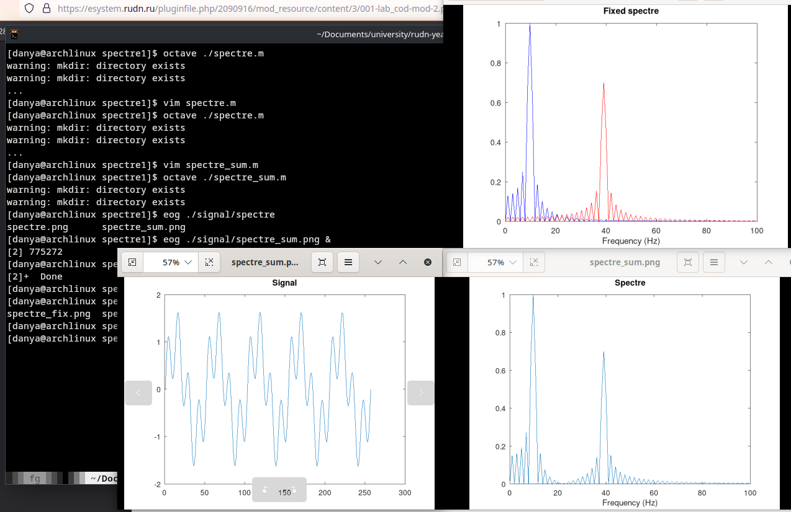

## Амплитудная модуляция
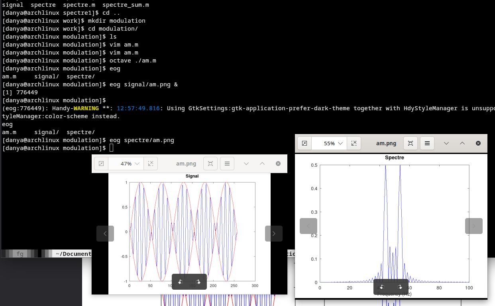

## Кодирование разными методами

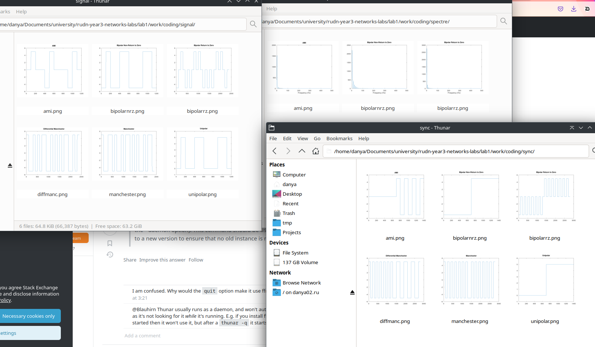

# Вывод

Я получил опыт работы с Octave для расчета и визуализации данных на примере сигналов и их модуляции.

Разные коды имеют разную способность самосинхронизироваться.

## Manchester

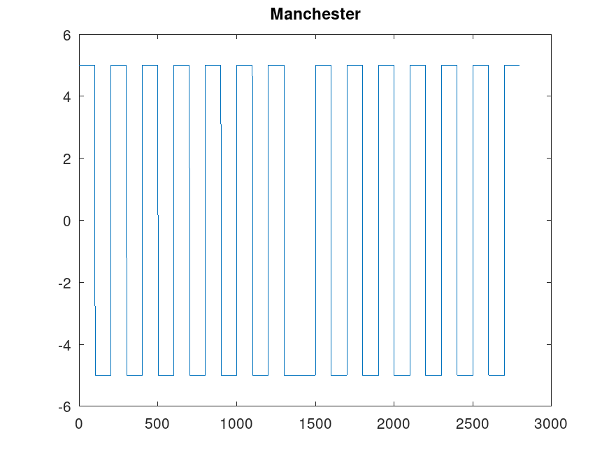

## Differenciated Manchester

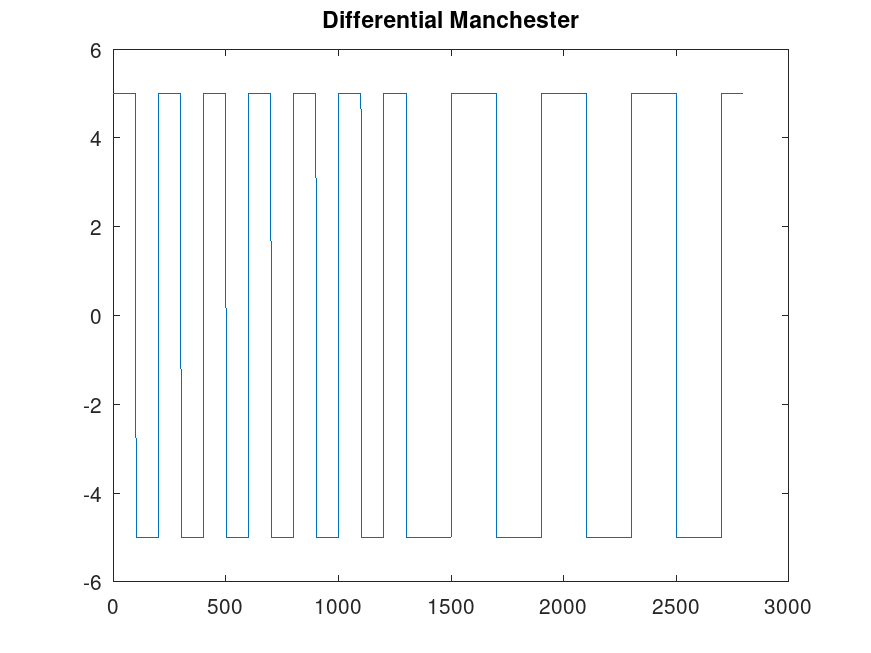

## Bipolar RZ

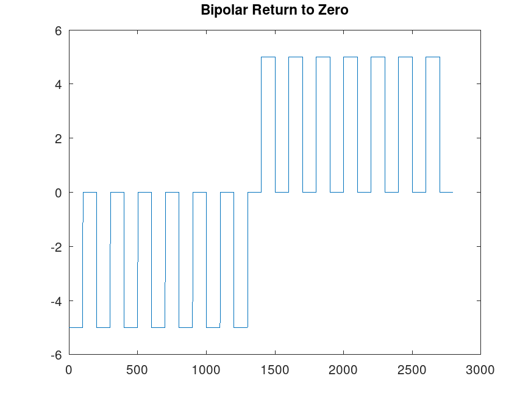

## AMI

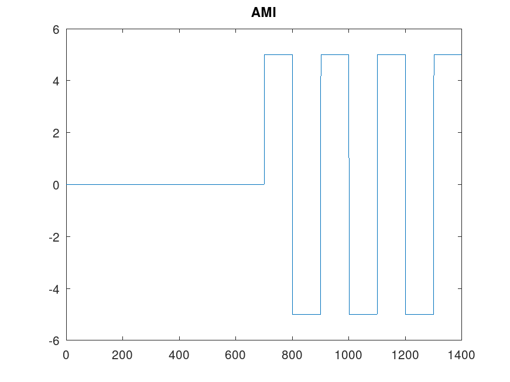

## Unipolar

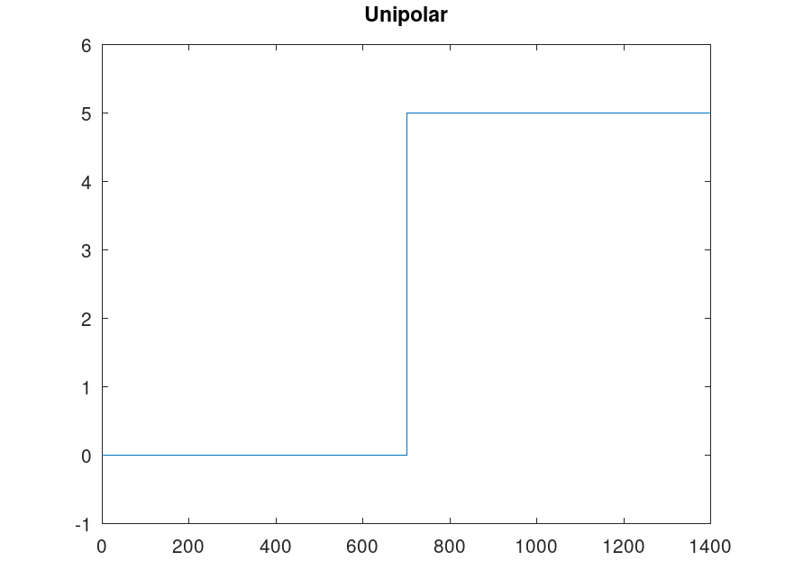

## Bipolar NRZ

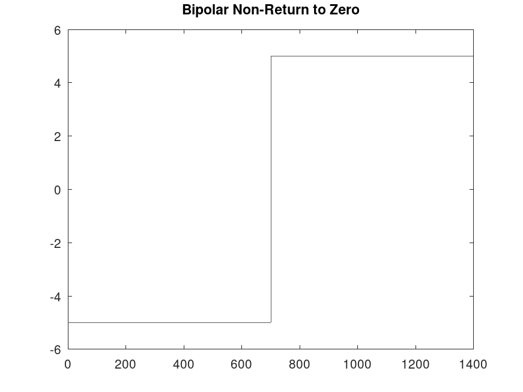
