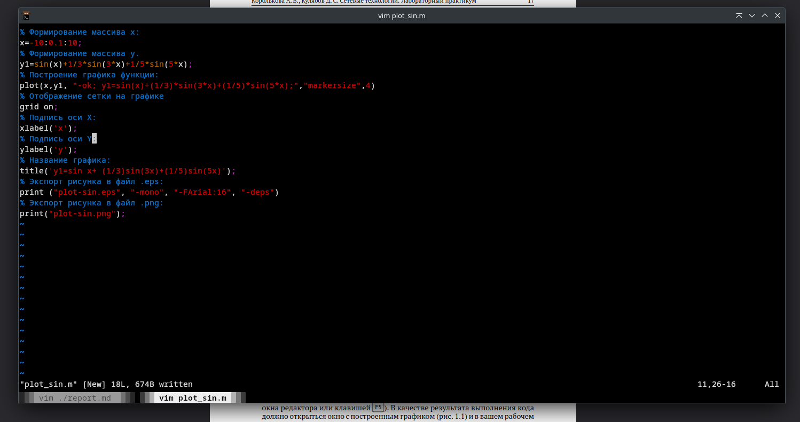
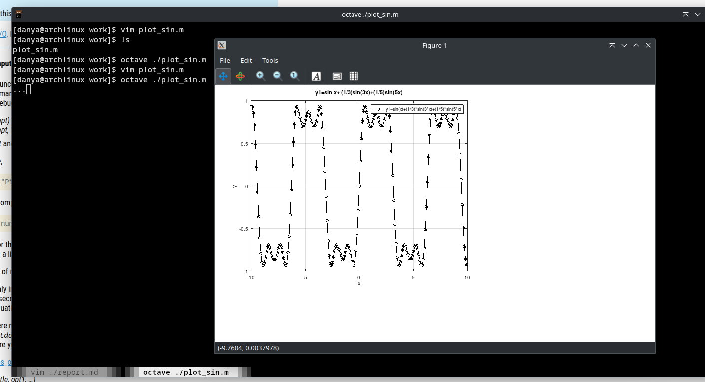
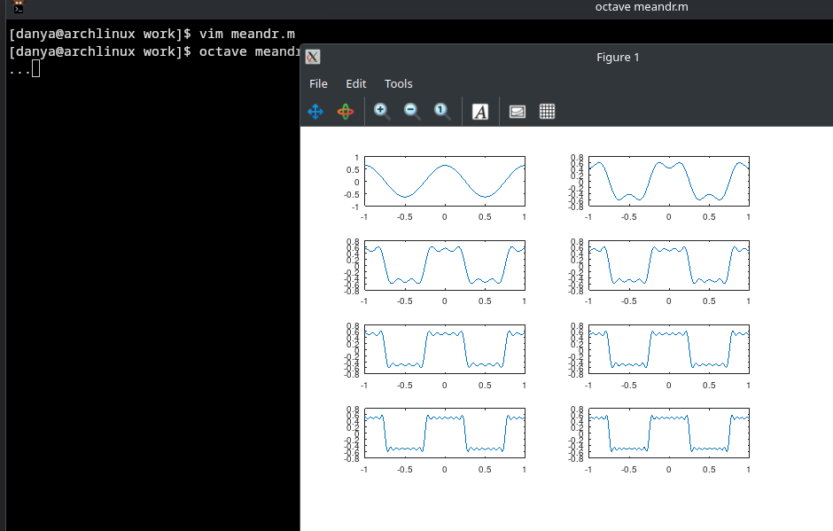
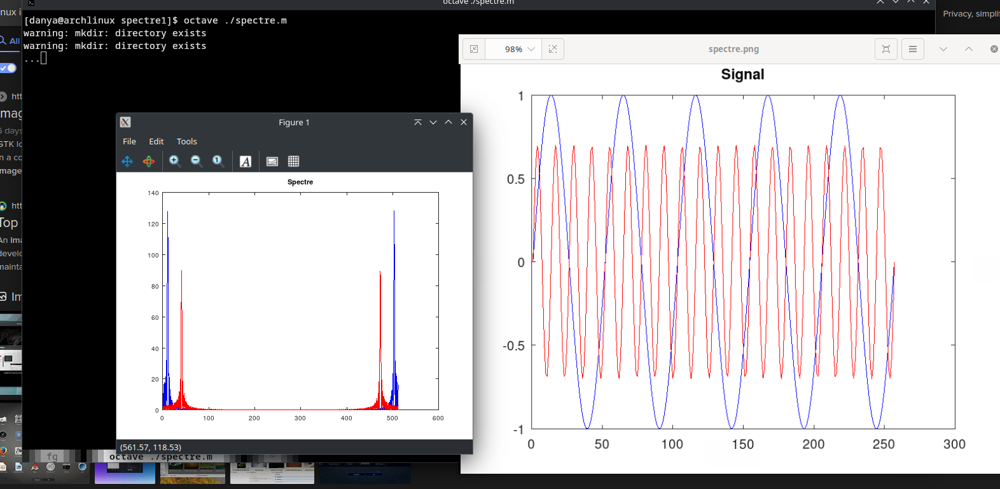
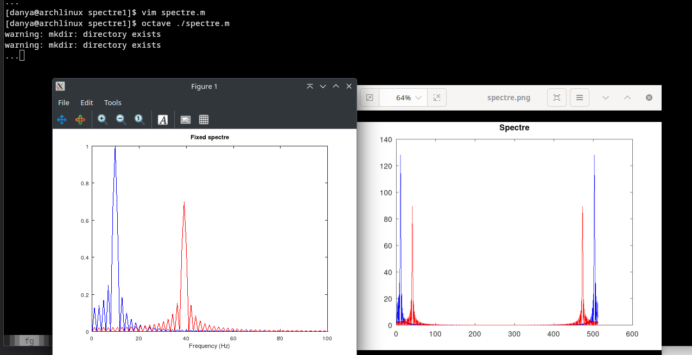
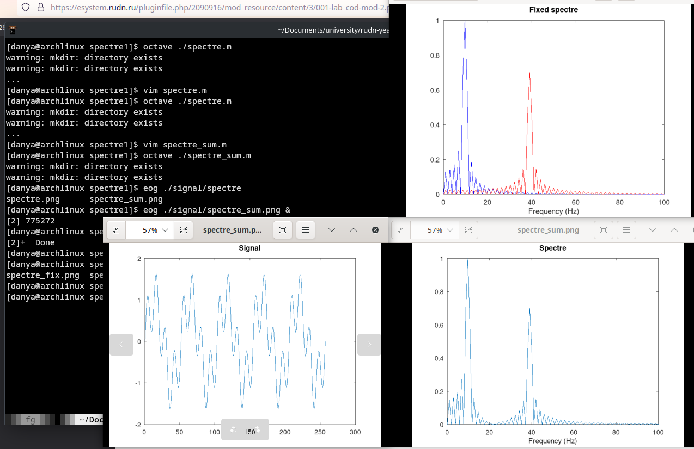

---
## Front matter
title: "Отчет по лабораторной работе 1"
subtitle: ""
author: "Генералов Даниил, НПИбд-01-21, 1032202280"

## Generic otions
lang: ru-RU
toc-title: "Содержание"

## Pdf output format
toc: true # Table of contents
toc-depth: 2
lof: true # List of figures
lot: true # List of tables
fontsize: 12pt
linestretch: 1.5
papersize: a4
documentclass: scrreprt
## I18n polyglossia
polyglossia-lang:
  name: russian
  options:
	- spelling=modern
	- babelshorthands=true
polyglossia-otherlangs:
  name: english
## I18n babel
babel-lang: russian
babel-otherlangs: english
## Fonts
mainfont: PT Serif
romanfont: PT Serif
sansfont: PT Sans
monofont: PT Mono
mainfontoptions: Ligatures=TeX
romanfontoptions: Ligatures=TeX
sansfontoptions: Ligatures=TeX,Scale=MatchLowercase
monofontoptions: Scale=MatchLowercase,Scale=0.9
## Biblatex
biblatex: true
biblio-style: "gost-numeric"
biblatexoptions:
  - parentracker=true
  - backend=biber
  - hyperref=auto
  - language=auto
  - autolang=other*
  - citestyle=gost-numeric
## Pandoc-crossref LaTeX customization
figureTitle: "Рис."
tableTitle: "Таблица"
listingTitle: "Листинг"
lofTitle: "Список иллюстраций"
lotTitle: "Список таблиц"
lolTitle: "Листинги"
## Misc options
indent: true
header-includes:
  - \usepackage{indentfirst}
  - \usepackage{float} # keep figures where there are in the text
  - \floatplacement{figure}{H} # keep figures where there are in the text
---

# Цель работы

В рамках этой лабораторной работы требуется познакомится с языком программирования GNU Octave,
и на основе его узнать про модуляцию сигналов.

# Задание

> 1.3.1. Построение графиков в Octave
> 1.3.2. Разложение импульсного сигнала в частичный ряд Фурье
> 1.3.3. Определение спектра и параметров сигнала
> 1.3.4. Амплитудная модуляция
> 1.3.5. Кодирование сигнала. Исследование свойства самосинхронизации сигнала
# Выполнение лабораторной работы

Сначала в рабочей директории я создал файл с кодом, чтобы посчитать и нарисовать на графике две функции и сохранить их в файл.

Для того, чтобы вывод программы оставался на экране, я добавил в конце файла команду `_ = input("...")`.
После запуска этого файла в Octave я получаю окно с графиком введеной функции.

После этого я скопировал этот файл и сделал так, чтобы отображались два графика на одном рисунке.

После этого я скопировал программу, которая выводит несколько разных приближений квадратной волны,
добавив сохранение рисунка в файл.

Затем я изменил формулу на альтернативную, которая задается через синусы, а не косинусы.
Для этого нужно было изменить генерацию массива гармоник, а также убрать строчку,
меняющую знак каждого второго элемента массива коэффициентов.

После этого я скопировал программу, которая получает сигнал и вычисляет его преобразование Фурье.
Она генерирует два графика, которые показываются в одном окне один за другим.
К счастью, они также сохраняются на диск, поэтому их можно посмотреть в программе просмотра изображений.

Для исправления артифактов, связанных с тем, что преобразование Фурье находит высокочастотные гармоники сигнала,
мы ограничиваем отображение диапазоном от 0 до 100,
что можно увидеть, сравнив графики до и после этого изменения.

Затем я запустил вторую программу, которая рисует тот же самый график преобразования Фурье для суммы сигналов.
Этот график для суммы сигналов похож на сумму графиков для отдельных сигналов, что демонстрирует свойство преобразования Фурье.

После этого я взял программу, которая выполняет амплитудную модуляцию сигнала, поточечно умножая его с несущей волной.
По полученному графику преобразования Фурье видно, что получившийся сигнал слабо коррелирует с частотой несущей волны 50Гц,
но сильно коррелирует с (50+5)Гц и (50-5)Гц; 5Гц -- это именно частота модулируемого сигнала.

После этого я установил библиотеки `control` и `signal`, а затем скопировал файлы с кодом, чтобы использовать их.
После запуска я получил папки с несколькими графиками, которые показывают результаты кодирования информации с помощью каждого из кодов.

# Выводы

Я получил опыт работы с Octave для расчета и визуализации данных на примере сигналов и их модуляции.

Самая полезная информация из рисунков разных методов кодирования -- это то, как они ведут себя при
наличии повторяющихся битов.
В папке `sync` показаны примеры того, как кодируется последовательность из множества нулей, а затем множества единиц -- 
вопрос в том, как из сигнала определить конец одного символа и начало другого.
Это можно сделать для нуля и единицы в Манчестерском, дифферинциированом Манчестерском, и биполярном RZ-кодах;
только для единицы -- в AMI-коде, и нельзя вообще для униполярного и биполярного NRZ-кода.

