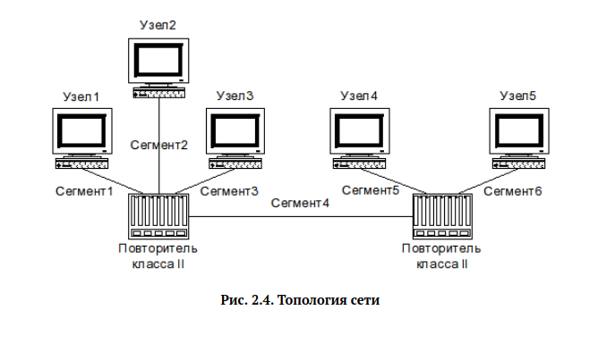

# Задача

> Требуется оценить работоспособность 100-мегабитной сети Fast Ethernet в соответствии с первой и второй моделями.

# Выполнение 

## Топология

## Первая модель -- диаметр < 205

N | Max2(1,2,3) | >200? | (5,6) | >200? | Max2(1,2,3,5,6)+4 | >205? | Вердикт
---|---|---|---|---|---|---|---
1  |188|Нет|194|Нет|198|Нет|Сеть работоспособна
2  |180|Нет|188|Нет|283|Да |Не соответствует
3  |155|Нет|190|Нет|200|Нет|Сеть работоспособна
4  |135|Нет|170|Нет|164|Нет|Сеть работоспособна
5  |155|Нет|190|Нет|210|Да |Не соответствует
6  |168|Нет|170|Нет|207|Да |Не соответствует

## Вторая модель -- время задержки < 412

Константная задержка -- 100+92+92=284би,
остается 224би = 201.43м

Вариант | Max2(1,2,3,5,6)+4 | >201.43? | Вердикт
---|---|---|---
1  |198|Нет|Сеть работоспособна
2  |283|Да |Не соответствует
3  |200|Нет|Сеть работоспособна
4  |164|Нет|Сеть работоспособна
5  |210|Да |Не соответствует
6  |207|Да |Не соответствует

## Вывод

Я получил опыт вычисления сетей Fast Ethernet с использованием двух моделей.
Эти две модели дают ответы, которые соответствуют друг другу в пределах погрешности,
и некоторые из необъясненных значений в первой модели непосредственно вытекают
из более сложного анализа во второй модели.
Поэтому можно сделать вывод, что эти две модели в целом взаимозаменяемы.