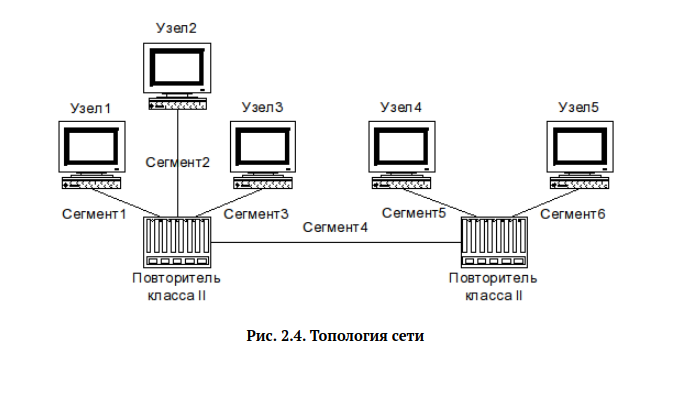

---
## Front matter
title: "Отчет по лабораторной работе 2"
subtitle: ""
author: "Генералов Даниил, НПИбд-01-21, 1032202280"

## Generic otions
lang: ru-RU
toc-title: "Содержание"

## Pdf output format
toc: true # Table of contents
toc-depth: 2
lof: true # List of figures
lot: true # List of tables
fontsize: 12pt
linestretch: 1.5
papersize: a4
documentclass: scrreprt
## I18n polyglossia
polyglossia-lang:
  name: russian
  options:
	- spelling=modern
	- babelshorthands=true
polyglossia-otherlangs:
  name: english
## I18n babel
babel-lang: russian
babel-otherlangs: english
## Fonts
mainfont: PT Serif
romanfont: PT Serif
sansfont: PT Sans
monofont: PT Mono
mainfontoptions: Ligatures=TeX
romanfontoptions: Ligatures=TeX
sansfontoptions: Ligatures=TeX,Scale=MatchLowercase
monofontoptions: Scale=MatchLowercase,Scale=0.9
## Biblatex
biblatex: true
biblio-style: "gost-numeric"
biblatexoptions:
  - parentracker=true
  - backend=biber
  - hyperref=auto
  - language=auto
  - autolang=other*
  - citestyle=gost-numeric
## Pandoc-crossref LaTeX customization
figureTitle: "Рис."
tableTitle: "Таблица"
listingTitle: "Листинг"
lofTitle: "Список иллюстраций"
lotTitle: "Список таблиц"
lolTitle: "Листинги"
## Misc options
indent: true
header-includes:
  - \usepackage{indentfirst}
  - \usepackage{float} # keep figures where there are in the text
  - \floatplacement{figure}{H} # keep figures where there are in the text
---

# Цель работы

В рамках этой лабораторной работы требуется произвести расчет сети Fast Ethernet.

# Задание

> Требуется оценить работоспособность 100-мегабитной сети Fast Ethernet в соответствии с первой и второй моделями.

# Выполнение лабораторной работы

Для выполнения приведена диаграмма топологии сети, которую требуется расчитать.
Мы имеем 6 случаев, которые различаются длиной этих сегментов.

## Первая модель
Чтобы проверить работоспособность сети относительно первой модели,
нужно посчитать диаметр домена коллизий и проверить, что он не превышает допустимого.
В нашем случае сеть содержит два хаба класса II, которые ограничивают диаметр домена коллизий
длиной в 205 метров.
Сеть состоит только из соединений 100BASE-TX.
Также, сеть можно разделить на две части, которые соединены сегментом 4:
каждая из них по отдельности может иметь диаметр 200 метров. 
Поэтому сначала нужно проверить, удолетворяет ли требованию первой модели отдельная группа сегментов (1,2,3),
отдельная группа сегментов (5,6), а затем их комбинация.

Вариант | Максимальный диаметр из (1,2,3) | Привышает ли длину 200? | Диаметр (5,6) | Привышает ли длину 200? | Максимальный общий диаметр | Привышает ли длину 205? | Вердикт
---|---|---|---|---|---|---|---
1  |188|Нет|194|Нет|198|Нет|Сеть работоспособна
2  |180|Нет|188|Нет|283|Да |Не соответствует
3  |155|Нет|190|Нет|200|Нет|Сеть работоспособна
4  |135|Нет|170|Нет|164|Нет|Сеть работоспособна
5  |155|Нет|190|Нет|210|Да |Не соответствует
6  |168|Нет|170|Нет|207|Да |Не соответствует

В каждом из этих вариантов, отдельные части удолетворяют требованию модели,
а их комбинация -- нет.
Поэтому, мы можем предсказать, что в вариантах 2, 5 и 6
сеть будет успешно определять коллизии между узлами 1, 2 и 3,
а также между 4 и 5,
но кадры, которые должны идти по сегменту 4, будут теряться без возможности распознать коллизию. 

## Вторая модель
Для расчета сети по второй модели нужно посчитать максимальное время прохождения сигнала по сети.
Для этого учитывается длина провода, скорость передачи сигнала в нем, а также время задержки от хабов.

В нашей сети используется витая пара категории 5, которая имеет удельное время двойного оборота в 1.112би/м.
Помимо этого, мы работаем с двумя хабами класса II и портами TX,
которые вносят задержку в 92би.
Чтобы сеть считалась работоспособной, нужно,
чтобы задержка внутри сети не привышала 412би,
поскольку 100би требуется для узлов, которые подключены TX-портами.

Как и раньше, мы расчитываем работоспособность для двух половин сети отдельно,
а затем для всей сети вместе.
Для двух половин время задержки в проводе не должно превышать (412-92=320)би,
а значит максимальная длина провода не должна быть больше (320би / 1.112би/м) = 287.76м.

Для сети в целом присутствуют постоянные задержки от терминалов и двух хабов класса 2,
поэтому время задержки не больше (412-92-92=228)би, а длина провода -- не больше (228би / 1.112би/м) = 205.03м.
Помимо этого, для безопасности рекомендуется соблюдать бюджет в 4би,
который ещё ограничивает длину провода до (224би / 1.112би/м) = 201.43м.

Как видно из предыдущей таблицы, в каждом случае, каждая из половин сети удолетворяет первому требованию.
Более того, ровно те сети, которые удолетворяли первой модели,
также удолетворяют второй модели, хотя это могло бы быть не так --
если бы максимальный диаметр сети был больше 201, но меньше 205,
то такая сеть выходила бы за границы бюджета для задержек во второй модели,
но удолетворяла бы первой модели

Вариант | Максимальный общий диаметр | Привышает ли длину 201.43? | Вердикт
---|---|---|---
1  |198|Нет|Сеть работоспособна
2  |283|Да |Не соответствует
3  |200|Нет|Сеть работоспособна
4  |164|Нет|Сеть работоспособна
5  |210|Да |Не соответствует
6  |207|Да |Не соответствует

# Выводы

Я получил опыт вычисления сетей Fast Ethernet с использованием двух моделей.
Эти две модели дают ответы, которые соответствуют друг другу в пределах погрешности,
и некоторые из необъясненных значений в первой модели непосредственно вытекают
из более сложного анализа во второй модели.
Поэтому можно сделать вывод, что эти две модели в целом взаимозаменяемы.