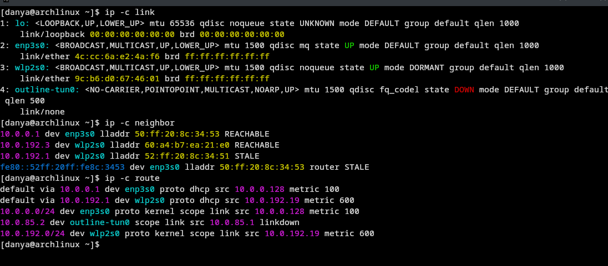
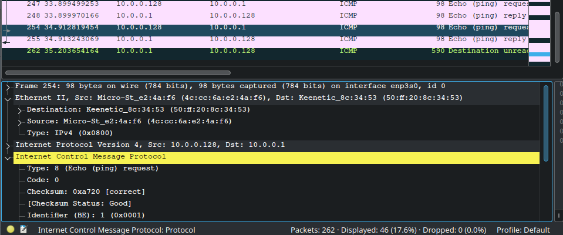
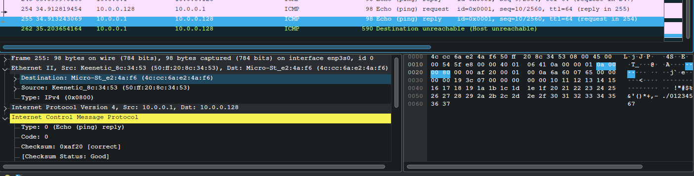
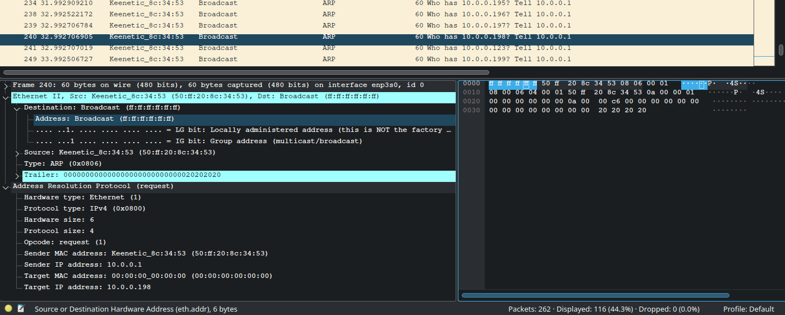
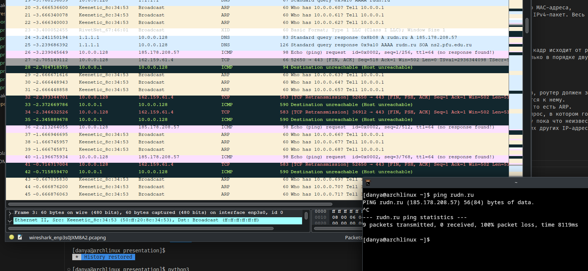
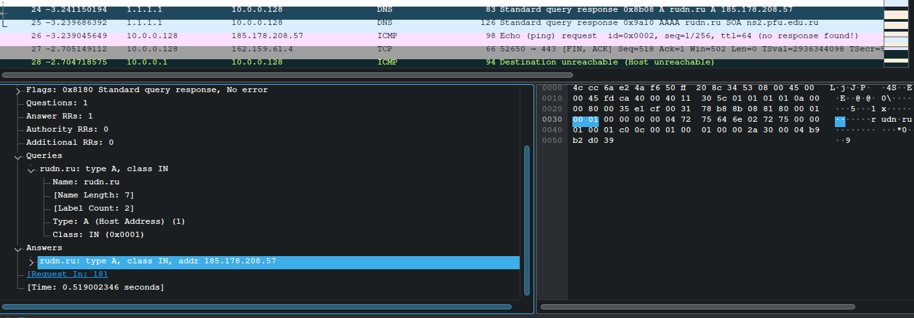
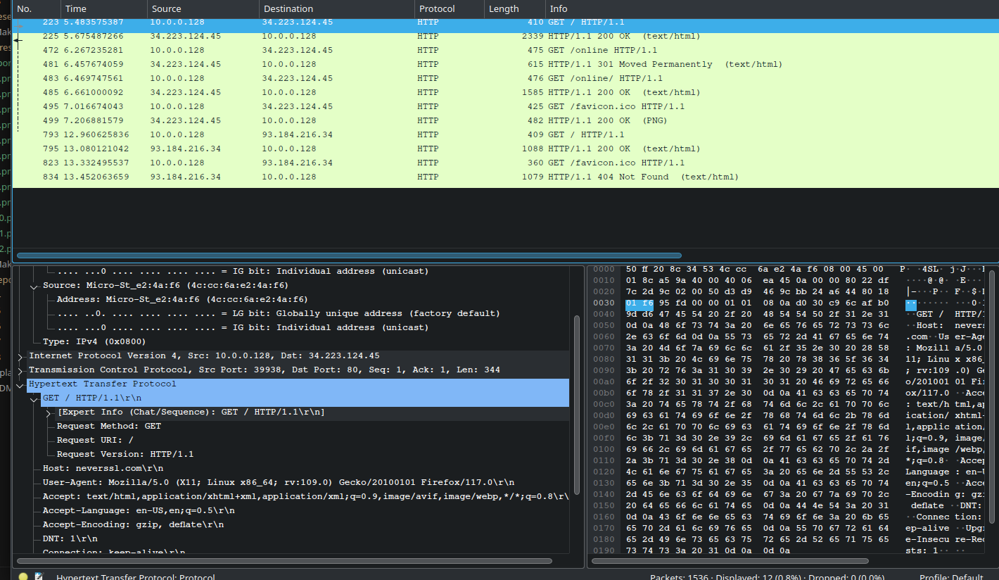
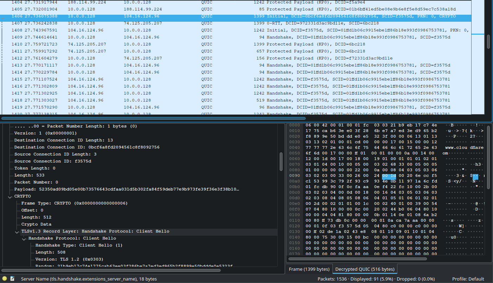
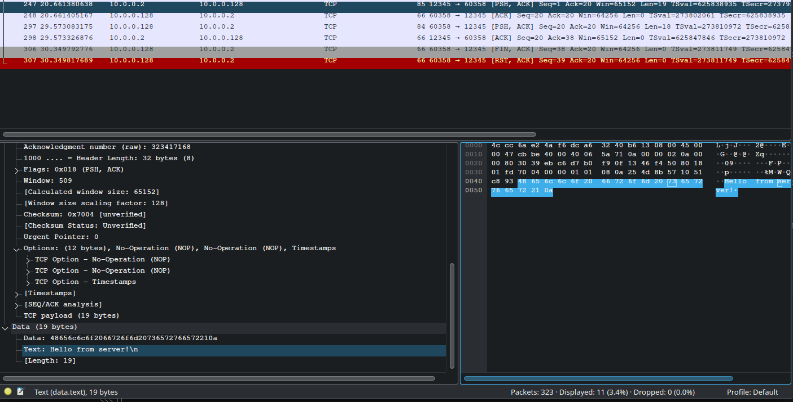

# Задача

> 3.3.1.1.1. Изучение возможностей команды ipconfig для ОС типа Windows (ifconfig для систем типа Linux).
> 3.3.1.1.2. Определение MAC-адреса устройства и его типа.
> 3.3.2.1.1. Установить на домашнем устройстве Wireshark.
> 3.3.2.1.2. С помощью Wireshark захватить и проанализировать пакеты ARP и ICMP в части кадров канального уровня.
> 3.3.3.1. С помощью Wireshark захватить и проанализировать пакеты HTTP, DNS в части заголовков и информации протоколов TCP, UDP, QUIC.
> 3.3.4.1. С помощью Wireshark проанализировать handshake протокола TCP.

# Выполнение 

## ip addr

## ip link, route, neighbor

## 4c:cc:6a = MSI

## 9c:b6:d0 = Rivet Networks

## Wireshark

## ICMP Echo

## ICMP Echo Reply

## ARP

## Ping rudn.ru

## DNS-запрос

## DNS-ответ

## Ping

## HTTP

## TLS Client Hello

## TLS Server Hello

## QUIC

## QUIC

## TCP

## TCP SYN

## TCP SYN ACK

## TCP ACK

## TCP PSH ACK

## TCP PSH ACK

## TCP FIN ACK

## Вывод

Я получил опыт работы с Wireshark для анализа пакетов в сети, а также с общими правилами работы различных сетевых протоколов.
