---
## Front matter
title: "Отчет по лабораторной работе 3"
subtitle: ""
author: "Генералов Даниил, НПИбд-01-21, 1032202280"

## Generic otions
lang: ru-RU
toc-title: "Содержание"

## Pdf output format
toc: true # Table of contents
toc-depth: 2
lof: true # List of figures
lot: true # List of tables
fontsize: 12pt
linestretch: 1.5
papersize: a4
documentclass: scrreprt
## I18n polyglossia
polyglossia-lang:
  name: russian
  options:
	- spelling=modern
	- babelshorthands=true
polyglossia-otherlangs:
  name: english
## I18n babel
babel-lang: russian
babel-otherlangs: english
## Fonts
mainfont: PT Serif
romanfont: PT Serif
sansfont: PT Sans
monofont: PT Mono
mainfontoptions: Ligatures=TeX
romanfontoptions: Ligatures=TeX
sansfontoptions: Ligatures=TeX,Scale=MatchLowercase
monofontoptions: Scale=MatchLowercase,Scale=0.9
## Biblatex
biblatex: true
biblio-style: "gost-numeric"
biblatexoptions:
  - parentracker=true
  - backend=biber
  - hyperref=auto
  - language=auto
  - autolang=other*
  - citestyle=gost-numeric
## Pandoc-crossref LaTeX customization
figureTitle: "Рис."
tableTitle: "Таблица"
listingTitle: "Листинг"
lofTitle: "Список иллюстраций"
lotTitle: "Список таблиц"
lolTitle: "Листинги"
## Misc options
indent: true
header-includes:
  - \usepackage{indentfirst}
  - \usepackage{float} # keep figures where there are in the text
  - \floatplacement{figure}{H} # keep figures where there are in the text
---

# Цель работы

В рамках этой лабораторной работы требуется использовать инструмент Wireshark для анализа трафика.

# Задание

> 3.3.1.1.1. Изучение возможностей команды ipconfig для ОС типа Windows (ifconfig для систем типа Linux).
> 3.3.1.1.2. Определение MAC-адреса устройства и его типа.
> 3.3.2.1.1. Установить на домашнем устройстве Wireshark.
> 3.3.2.1.2. С помощью Wireshark захватить и проанализировать пакеты ARP и ICMP в части кадров канального уровня.
> 3.3.3.1. С помощью Wireshark захватить и проанализировать пакеты HTTP, DNS в части заголовков и информации протоколов TCP, UDP, QUIC.
> 3.3.4.1. С помощью Wireshark проанализировать handshake протокола TCP.

# Выполнение лабораторной работы

Сначала я использовал утилиту `ip` (бывшая `ifconfig`) для того, чтобы получить информацию о сетевых соединениях своего компьютера.
Большинство полезной информации об этом можно получить из выдачи команды `ip address`.

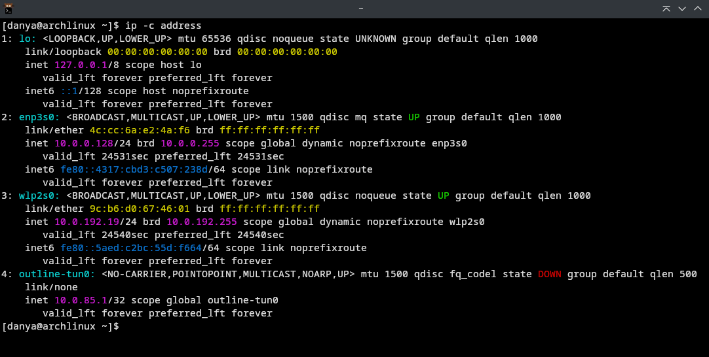

Из этого видно, что у меня есть 4 сетевых интерфейса:
- loopback-интерфейс `lo`, который присутствует на каждом компьютере и перенаправляет пакеты обратно на этот компьютер;
- Ethernet-адаптер `enp3s0`, который подключен с IP-адресом `10.0.0.128` и работает;
- Wi-Fi-адаптер `wlp2s0`, который подключен с IP-адресом `10.0.192.19` и работает;
- TUN-адаптер `outline-tun0`, который управляется приложением Outline и сейчас не работает, но если бы работал, то мой компьютер имел бы адрес `10.0.85.1`.

Из других подкоманд команды `ip` можно узнать другую интересную информацию. Например:

- соединения `enp3s0` и `wlp2s0` имеют `link/ether`, что значит, что по этим интерфейсам проходят совместимые Ethernet-пакеты, и приведен их MAC-адрес.
- по проводному соединению `enp3s0` можно связаться только с роутером `10.0.0.1`, потому что провод подключен непосредственно туда, однако по беспроводному соединению `wlp2s0` можно связаться не только с роутером `10.0.192.1`, но и с моей IP-камерой `10.0.192.3`; именно это соединение предоставляет изображение с камеры для видео выполнения этой лабораторной работы;
- мой компьютер будет отправлять пакеты для подсети `10.0.0.0/24` через устройство `enp3s0` и подписывать их своим IP-адресом `10.0.0.128`,  для подсети `10.0.102.0/24` через устройство `wlp2s0` и подписывать их своим IP-адресом `10.0.192.19`, а для остальных сначала будет пробовать отправить их через `10.0.0.1`, а затем через `10.0.192.1`.

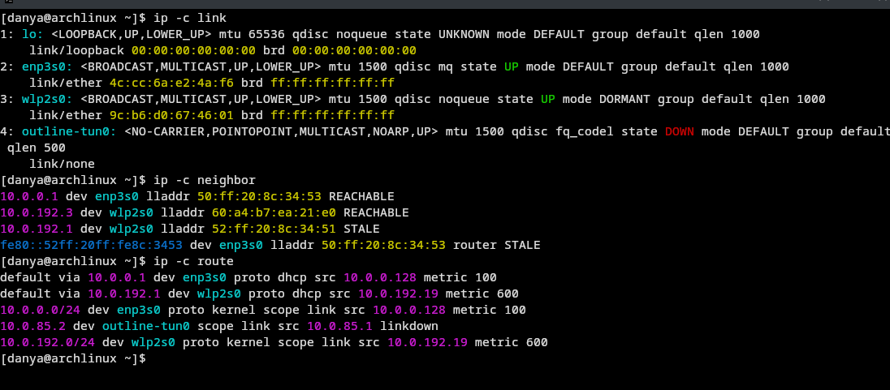

Также можно проанализировать MAC-адреса двух физических устройств: `enp3s0=4c:cc:6a:e2:4a:f6` и `wlp2s0=9c:b6:d0:67:46:01`.
Из последних двух битов первого байта можно определить тип этих адресов -- поскольку оба этих бита равны нулю,
можно понять, что это уникастовые (индивидуальные) и глобально-настроенные MAC-адреса (потому что я их не менял на своем устройстве).

Первые три байта, за исключением этих двух битов, обозначают производителя сетевого устройства.
Если поискать в интернете первые три байта, то можно определить, что `4c:cc:6a` принадлежит `Micro-Star INTL CO., LTD.`,
а `9c:b6:d0` -- `Rivet Networks`.

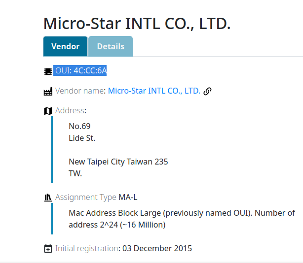

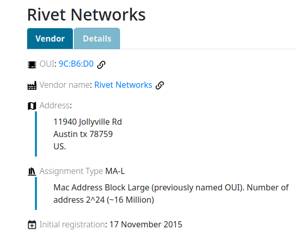

Первое название мне известно, потому что это -- редко-используемое полное название компании MSI, от которой мой ноутбук.
Второе название мне незнакомо, но на первой странице поиска можно найти новости о том, что эта компания была куплена Intel и раньше была производителем Wi-Fi модулей под брендом Killer, что соответствует надписи на рекламной этикетке на ноутбуке.

После этого я начал использование Wireshark. Я открыл программу и выбрал захват на интерфейсе `enp3s0`, потому что другой интерфейс в данный момент слишком занят трафиком с IP-камеры.
Запустив в отдельном окне ping на адрес своего роутера, я увидел ICMP-пакеты от моего компьютера к роутеру, а также сразу после этого пакеты от роутера к компьютеру.

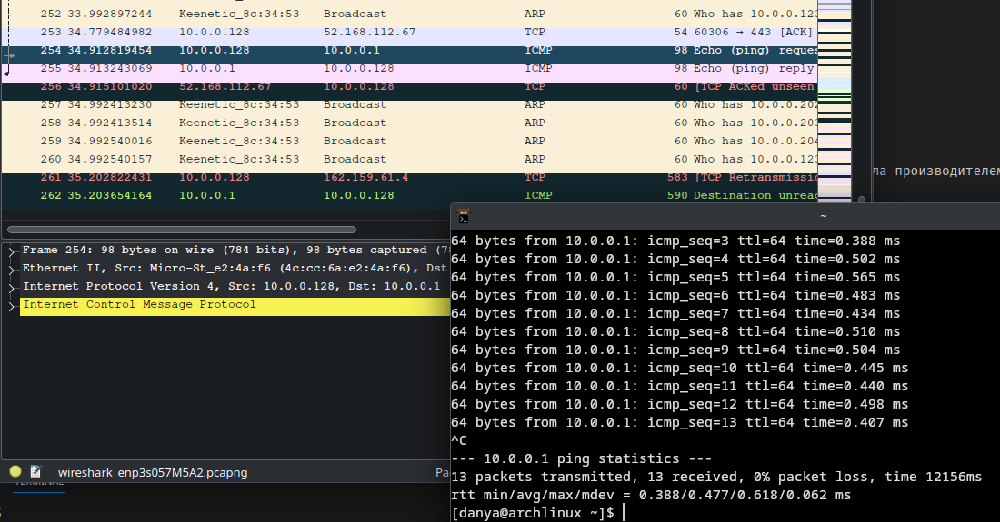

Мы рассмотрим пакеты 254 и 255 в записи. 
Пакет 254 -- это `ICMP Echo request`, который находился в IP-пакете, который -- внутри Ethernet-кадра. Ethernet-кадр отправлялся от моего MAC-адреса, `4c:cc:6a:e2:4a:f6`, и направлялся к MAC-адресу моего роутера, `50:ff:20:8c:34:53`. Кадр имеет тип `0x0800`, что значит, что он содержит IPv4-пакет. Весь кадр занимал 98 байтов, все из которых видны в записи.

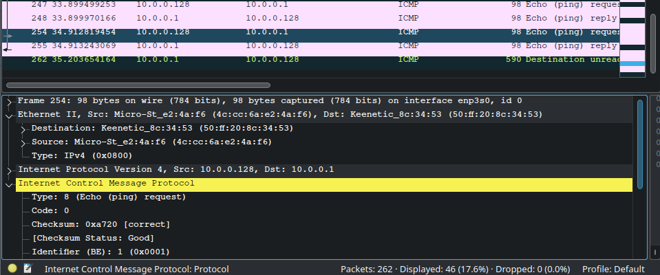

Пакет 255 -- `ICMP Echo reply`, который в итоге находился в Ethernet-кадре, который также имеет тип `0x0800` и содержит IPv4-пакет. Этот кадр исходит от роутера, `50:ff:20:8c:34:53`, и направляется к моему ноутбуку, `4c:cc:6a:e2:4a:f6`. Он также имеет длину в 98 байтов, потому что он отличается только в порядке двух адресов, а также в значениях нескольких байтов.

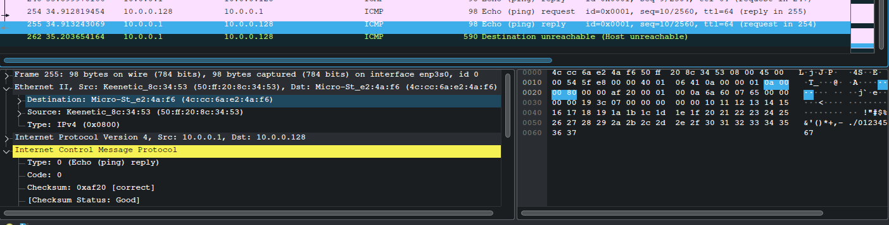

Также в этой записи присутствуют много ARP-пакетов от моего роутера. Для того, чтобы работал веб-интерфейс, показывающий список устройств, роутер должен знать про все устройства, которые подключены к его сети; поэтому он систематически отправляет ARP-запросы по каждому из IP-адресов, которые относятся к нему.
Каждый из этих запросов -- это широковещательный Ethernet-пакет (направленный на `ff:ff:ff:ff:ff:ff`), который имеет Ethertype `0x0806`, то есть ARP.
Внутри этого кадра, роутер говорит, что речь идет про Ethernet и IPv4-адреса, которые имеют размеры 6 и 4 соответственно, и он делает запрос, в котором говорит,
что он имеет IP-адрес `10.0.0.1` и MAC-адрес `50:ff:20:8c:34:53`, и он хочет узнать про IP-адрес `10.0.0.198`, MAC-адрес для которого ему пока что неизвестен.
Никто не отвечает, потому что по этому физическому порту к роутеру подключен только мой компьютер, про который роутер уже знает, и никаких других IP-адресов у него нет.

После этого я перезапускаю запись, и в другом окне запускаю `ping rudn.ru`. 
В окне Wireshark мы видим, как происходил этот весьма односторонний разговор.

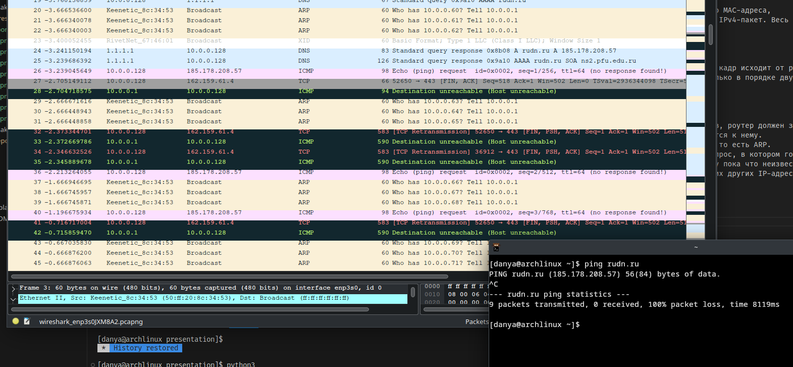

Сначала мой компьютер должен узнать, какой IP-адрес у домена `rudn.ru`. Для этого он задает DNS-запрос своему настроенному DNS-серверу, который в моем случае -- `1.1.1.1`. В запросе он спрашивает про IN A-запись, связанную с `rudn.ru`. Это все происходит внутри UDP-пакета, который внутри IP-пакета который находится внутри Ethernet-кадра с Ethertype=`0x0800` и длиной в 67 байтов. (В лабораторной работе написано проанализировать ARP-пакеты, но они не имеют отношения к этому разговору, и мне кажется, что на самом деле подразумевались запросы DNS.)

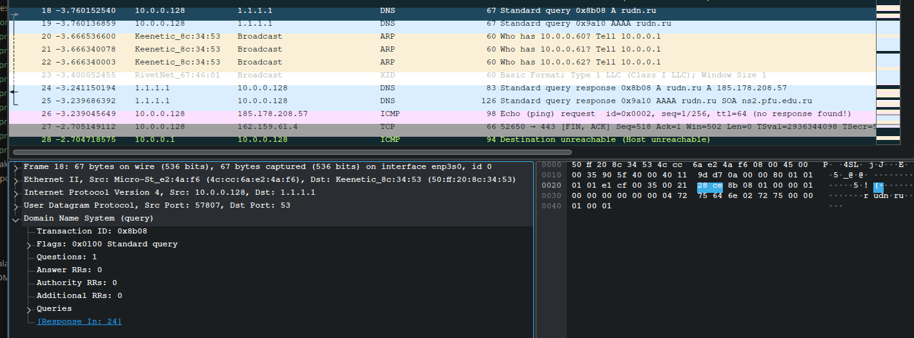

Вскоре после этого мне приходит ответ -- IN A для `rudn.ru` равен `185.178.208.57`. Эту информацию можно запомнить на 3 часа, или 10800 секунд, в течении которых она должна быть актуальной.
Этот ответ также находится в UDP-пакете, в IP-пакете от `1.1.1.1`, который в Ethernet-пакете от моего роутера.

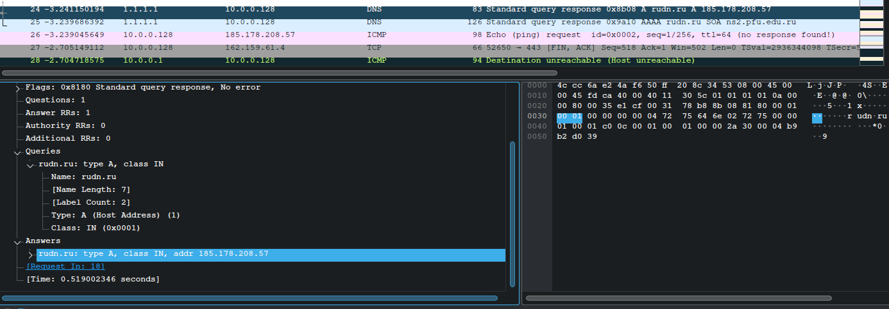

Теперь, когда мы знаем IP-адрес нашего назначения, `rudn.ru`, мы можем начать отправлять ICMP Echo туда. Они уходят от нас, внутри IP-пакетов, а затем внутри Ethernet-кадров с Ethertype=`0x0800` и адресованных роутеру на его индивидуальный, глобально-настроенный MAC-адрес.
Но после этого мы не получаем ответов.
Это может значить, что на пути между мной и `185.178.208.57` есть проблема с сетью, которая мешает моим пакетам добраться до него, или его пакетам добраться до меня.
Однако в этом случае я знаю, что сам сайт `rudn.ru` работает и доступен с моего компьютера, поэтому вторая причина -- это администратор `185.178.208.57` настроил его так, чтобы он не отвечал на ICMP Echo.
Это обычно делают ради возможного улучшения в безопасности, потому что становится слегка сложнее определить, что по этому IP-адресу есть работающий компьютер,
но это также делает отладку сетевых соединений гораздо более сложной.

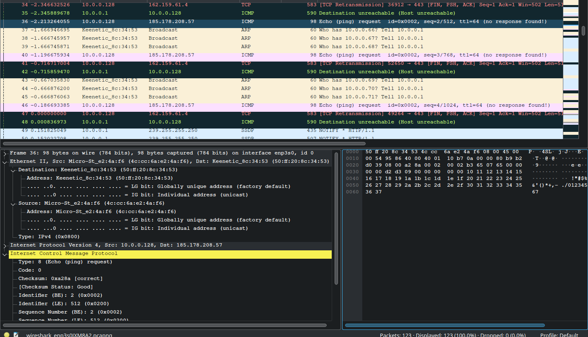

После этого я начал анализ протоколов прикладного уровня, на примере HTTP.
Я запустил новую запись, а затем в браузере зашел на страницу `http://neverssl.com`,
затем на `https://example.com`, а затем на `https://cloudflare-quic.com`.
В первом случае я получил пакеты простого HTTP,
во-втором -- пакеты HTTPS, а именно HTTP внутри TLS,
а в третьем -- пакеты QUIC.

Сначала мы смотрим на `http`-сообщения.
HTTP -- это текстовый протокол, поэтому незашифрованные сообщения можно прочитать глазами.
Сначала браузер посылает запрос, в данном случае `GET / HTTP/1.1` на домен `neverssl.com`.
После этого сервер отвечает `200 OK`, и возвращает HTML-страницу, которая сжата gzip.
Из-за этого сжатия, когда браузеру потребовалось целых 410 байтов, чтобы попросить у сервера показать страницу,
серверу же хватило лишь 2339, чтобы согласиться, отправить мне метаданные, а также весь текст и разметку страницы.
После этого там есть несколько других запросов-ответов, которые в целом выглядят так же:
я спрашиваю у сервера вернуть мне ресурс, и указываю в каком виде я хочу его видеть,
а сервер отправляет мне в ответ содержимое этого ресурса.
Все это, конечно же, происходит внутри TCP-пакетов, которые внутри IP-пакетов, которые внутри Ethernet-кадров, которыми обменивается мой компьютер и роутер.

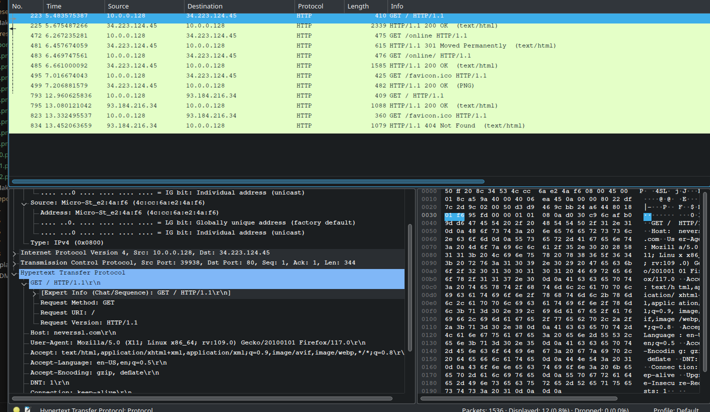

Затем рассмотрим `tls`-сообщения, которыми мы обменивались с `example.com`, когда использовали HTTPS.
TLS-соединения используются чаще всего, и мой браузер устанавливает многие из них в фоновом режиме,
поэтому я также фильтрую по IP-адресу.

Сначала мой компьютер делает `Client Hello`, в котором он говорит серверу, с кем именно мы хотим говорить (в данном случае, с `example.com`), какие протоколы мы хотим использовать внутри TLS-соединения (`h2` и `http/1.1`), и какие криптографические примитивы мы готовы использовать.

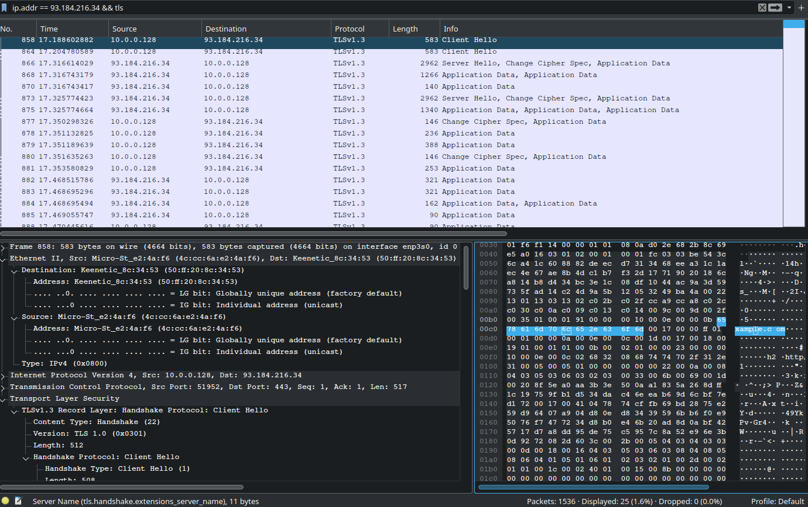

Затем сервер отвечает своим `Server Hello`, где он говорит нам, что он поддерживает TLSv1.3, затем указывает, какие шифры он будет использовать,
выполняет свою половину обмена ключами (через эллиптическую кривую `secp256r1`), а затем посылает нам несколько зашифрованных данных.
Браузер в этот момент совершил свою половину обмена ключами и знает, как расшифровать эти данные,
и уже внутри них они ведут разговор о более высокоуровневых деталях, вроде сертификатов сервера и клиента,
а также содержимым веб-страницы.

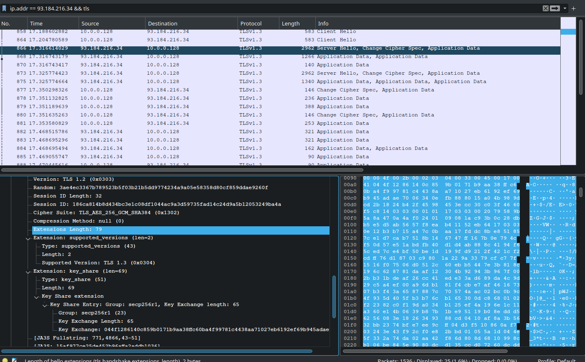

Наконец, мы смотрим на `quic`-сообщения. 
Здесь уже сложнее понять, что происходит,
в том числе потому что тут идут разговоры с сайтами на которые я не заходил (вроде `cloudflare.com`),
что возможно является предварительной загрузкой от браузера.

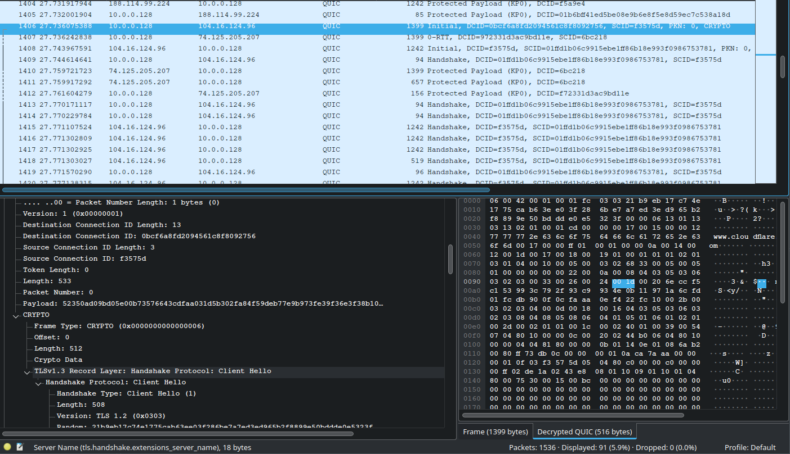

В QUIC соединения не связаны с TCP-соединениями, потому что QUIC работает по UDP.
Вместо этого, соединения идентифицируются двумя значениями: `SCID` и `DCID`, соответственно `Source Connection ID` и `Destination Connection ID`.
Благодаря этому, клиенты могут менять свой IP-адрес во время соединения,
а также поддерживать много соединений параллельно.
Мы видим, что когда сервер пишет нам, он говорит, что его `SCID` очень длинный -- 20 байтов -- в то время как для нас `DCID` всего лишь три байта.
Это потому, что серверу может быть нужно поддерживать очень большое количество разговоров одновременно,
и он может хранить какую-то важную для себя информацию в своих ID,
в то время как нашему браузеру нужно держать в памяти сравнительно маленькое количество соединений.

Чтобы понять процедуру установления соединения в QUIC, я запустил свежую запись.
В ней я получил одну транзакцию QUIC, которую сделал мой браузер на `profile.accounts.firefox.com`.
Мы начинаем с пакета `Initial`, внутри которого мы кладем стандартный TLS Client Hello.
Сервер отвечает с `Protected Payload (KP0)`, который можно расшифровать, если иметь доступ к `Initial` -- 
в нем сервер отвечает своим TLS Server Hello.
Также на этом уровне сервер подменяет выбранный клиентом `DCID` на тот, который сервер сам хочет использовать --
когда клиент отправляет `Initial`, у него нет ID соединения, поэтому он генерирует его случайно.
После этого клиент и сервер продолжают обмен `Protected Payload (KP0)`, которые уже расшифровать нельзя, не зная деталей TLS-обмена ключами.
Также существуют сообщения типа `0-RTT`, которые видимо позволяют напомнить серверу о соединении, которое было открыто раньше,
и не открывать это соединение заново.

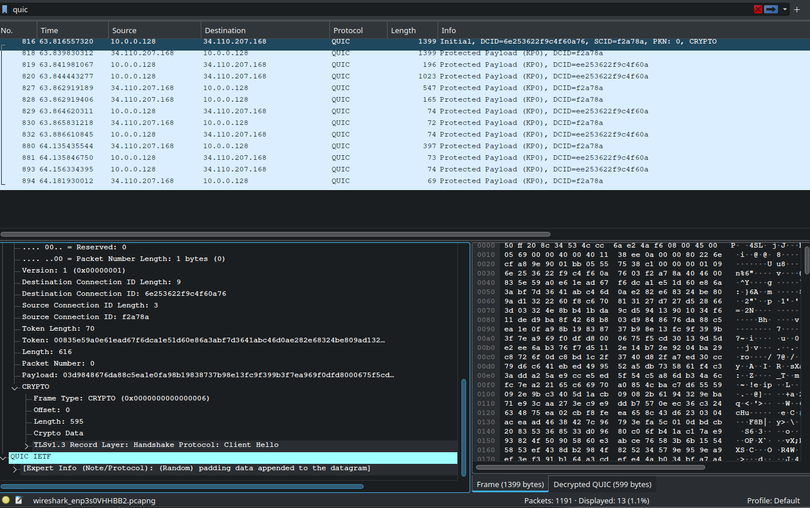

Теперь мы смотрим более детально на TCP-соединение, а именно то, как оно устанавливается.
Для этого я сделал новую запись, в которой с помощью `netcat` переслал несколько пакетов между своим компьютером и своим домашним сервером на `10.0.0.2`.

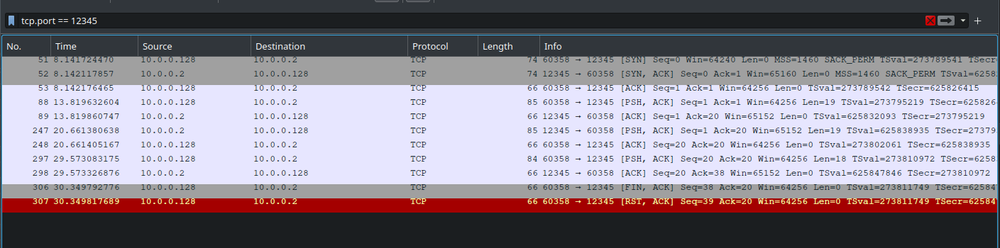

Соединение начинается с `SYN`-пакета, который клиент отправляет серверу. В этом пакете он указывает, с каким портом он хочет общаться, в данном случае 12345.

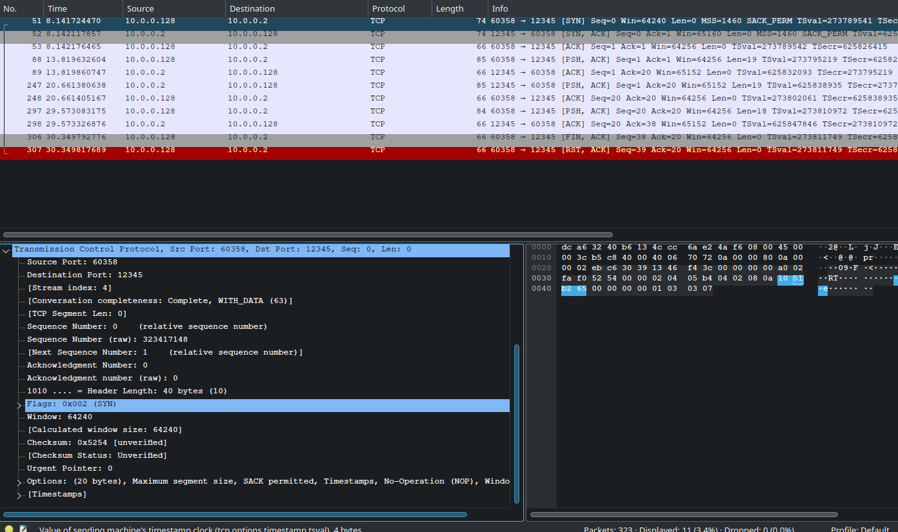

Сервер отвечает пакетом `SYN+ACK`. Этим он говорит, что он получил запрос начать соединение, и готов это сделать.

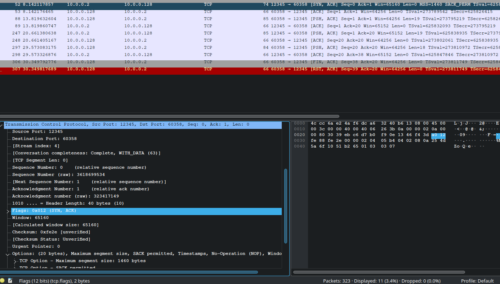

Клиент затем отвечает пакетом `ACK`, что значит, что он теперь знает, что сервер подготовил соединение, и теперь клиент и сервер оба готовы отправлять пакеты.

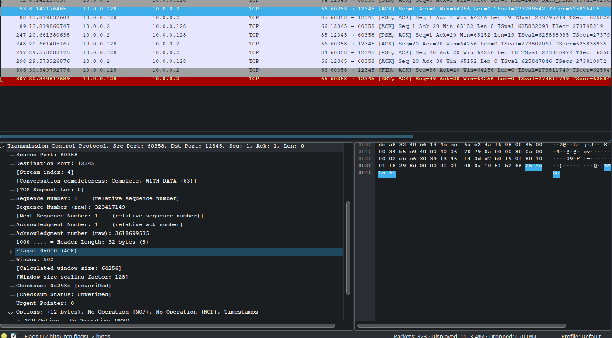

После этого клиент может отправлять серверу пакеты, которые будут иметь флаги `PSH+ACK`, и этим он передает данные серверу и просит подтверждения получения.
Сразу же после этого мы получаем от сервера пакеты `ACK`, которые говорят нам, что этот пакет был получен.

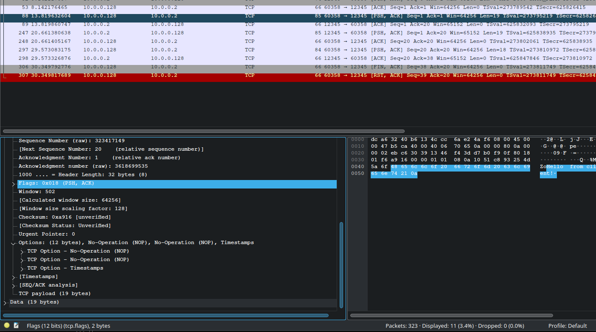

Сервер может делать то же самое, отправляя `PSH+ACK`-пакеты клиенту и передавая ему данные, и мы будем в ответ отправлять `ACK`.

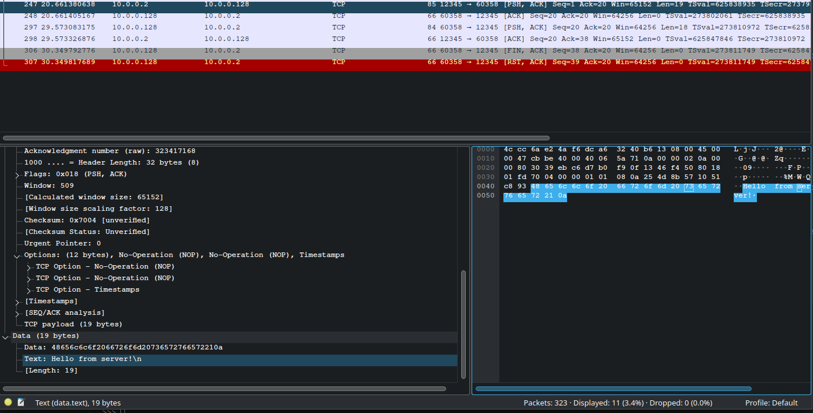

В конце концов, либо клиент, либо сервер закроют соединение.
В данном случае это сделал клиент, отправив `FIN+ACK`-пакет, который говорит другому концу, что соединение завершается.
Также, в этом случае, клиент после этого отправил `RST+ACK`-пакет, который говорит другому концу полностью забыть про это соединение.
Это произошло потому, что я закрыл `netcat` с помощью `Ctrl+C`, и это оставило сетевой стек ядра с открытым TCP-соединением, которое больше никому не принадлежит.
Если бы программа не закрылась так быстро, то мы бы увидели сообщение от сервера, которое подтверждает закрытие соединения.

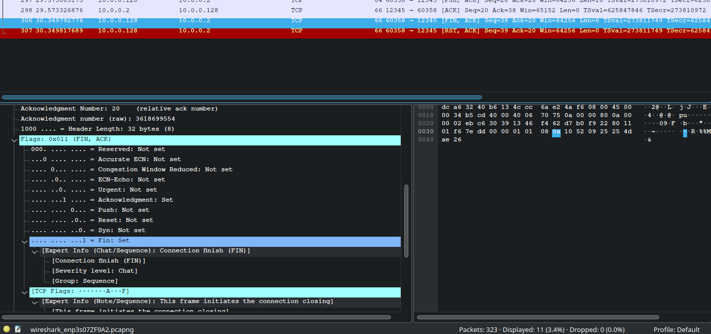

# Выводы

Я получил опыт работы с Wireshark для анализа пакетов в сети, а также с общими правилами работы различных сетевых протоколов.
