# Задача

> 1. Установить GNS3-all-in-one, GNS3 VM, проверить корректность запуска (см. раздел 4.3).
> 2. Импортировать в GNS3 образ маршрутизатора FRR (см. раздел 4.4).
> 3. Импортировать в GNS3 образ маршрутизатора VyOS (см. раздел 4.4).

# Выполнение 

## yay

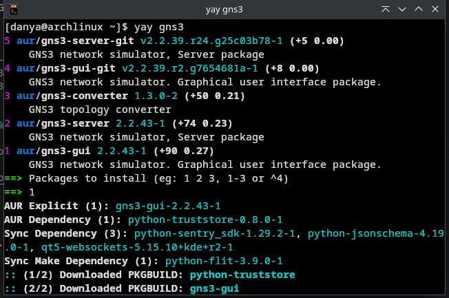

## github

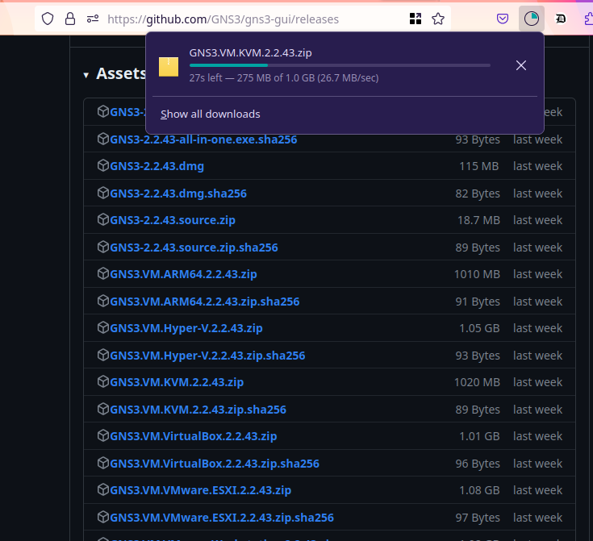

## gns3-vm

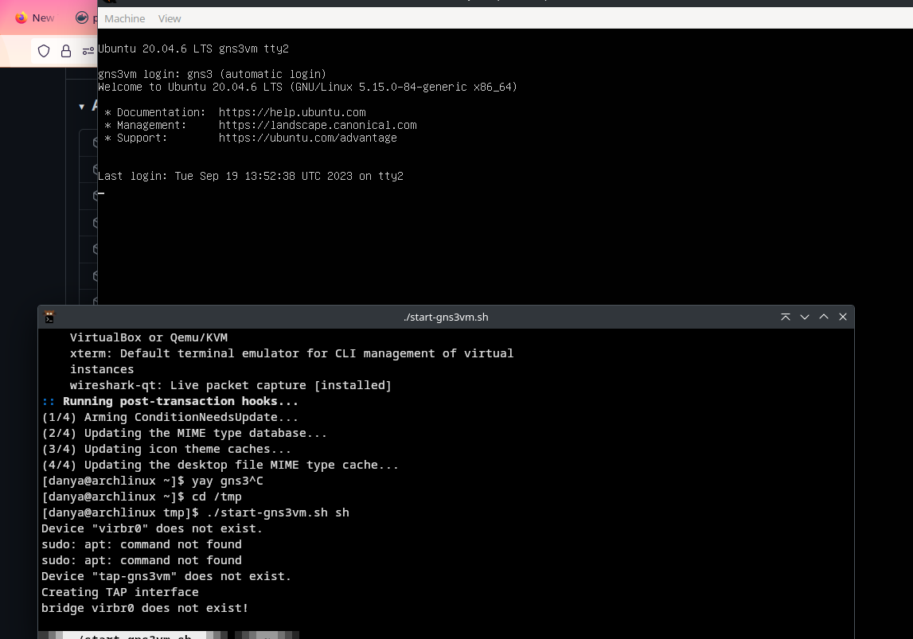

## yay dnsmasq

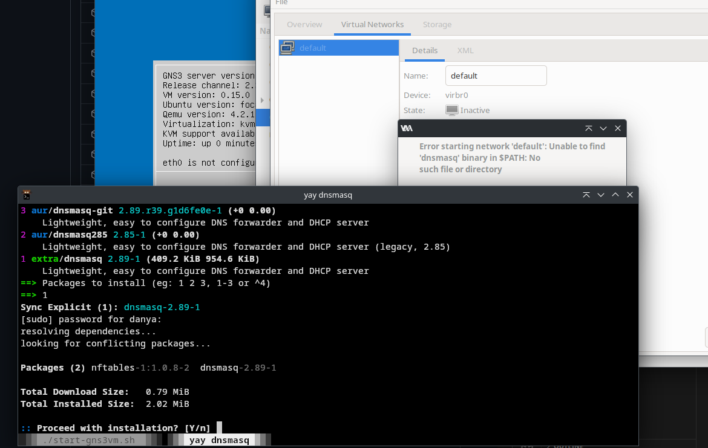

## gns3-vm

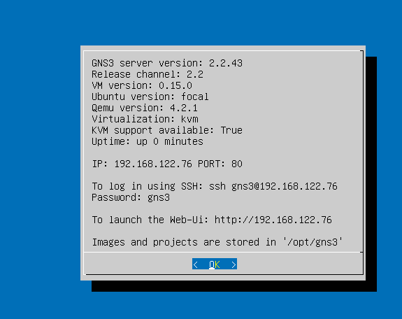

## gns3

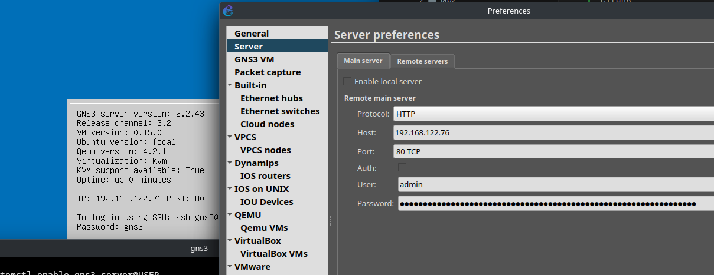

## yay inetutils

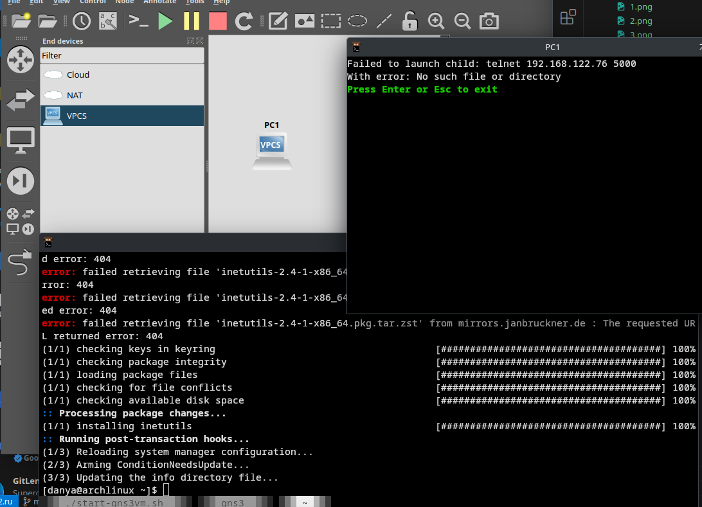

## appliance

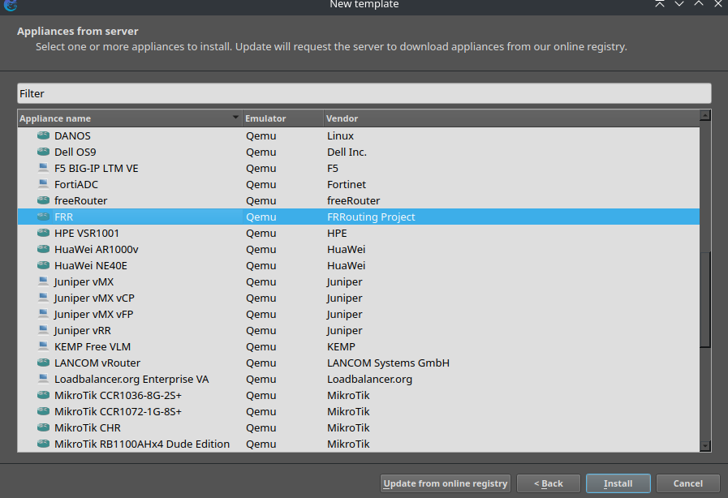

## appliance

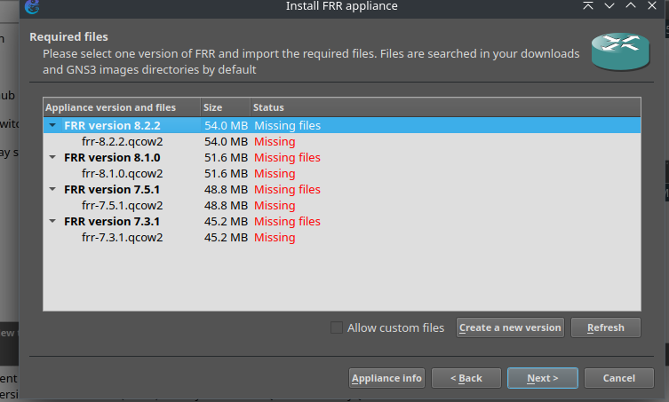

## appliance

## frr

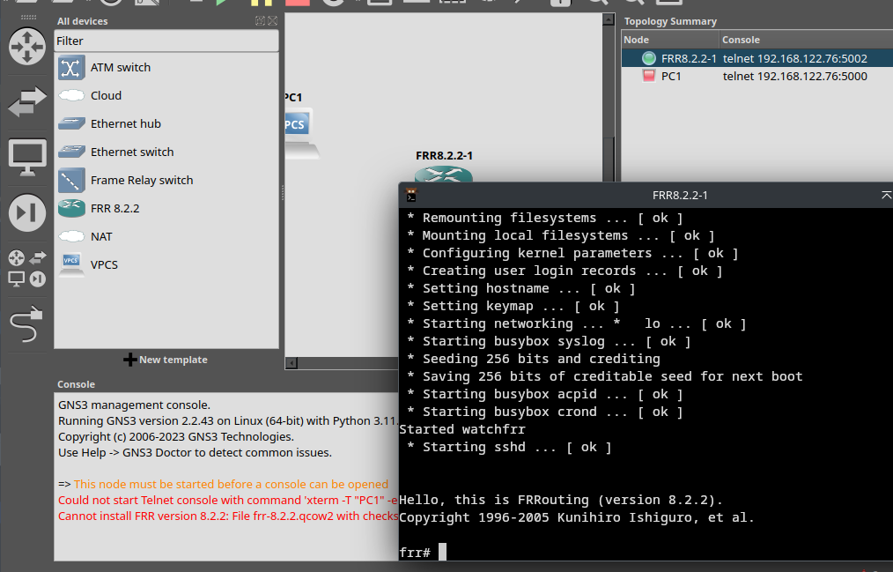

## vyos

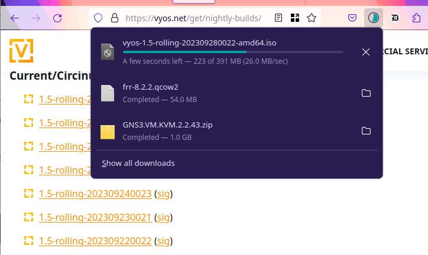

## appliance

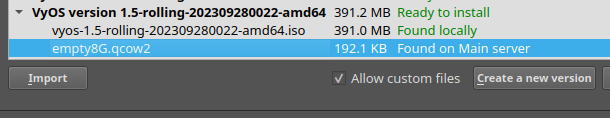

## Вывод

Я получил опыт установки и начальной настройки GNS3.
