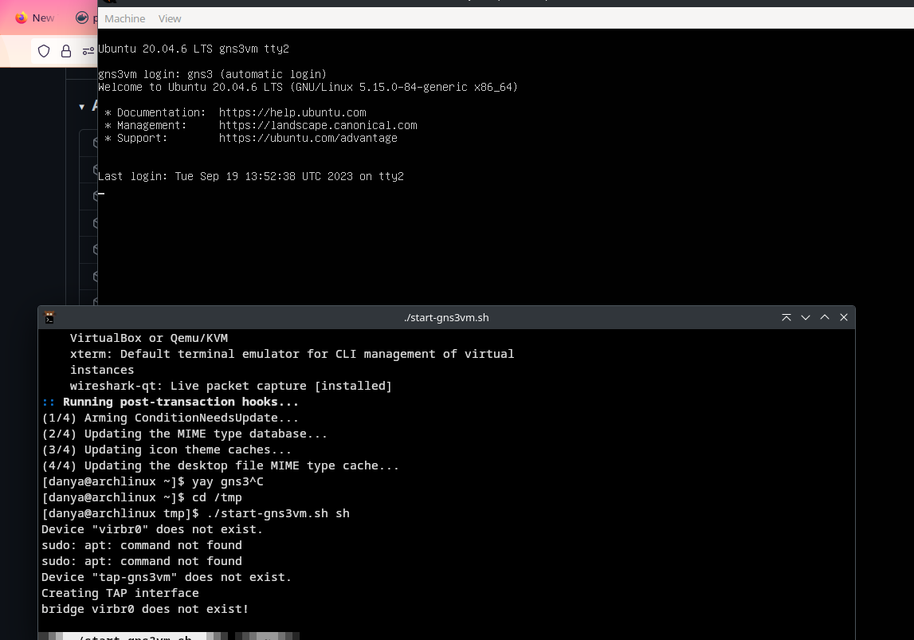
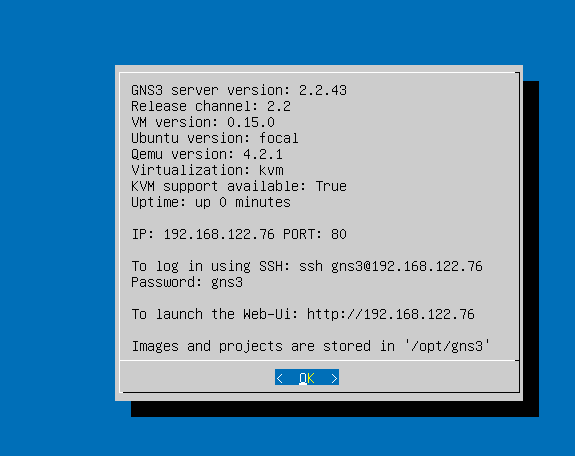
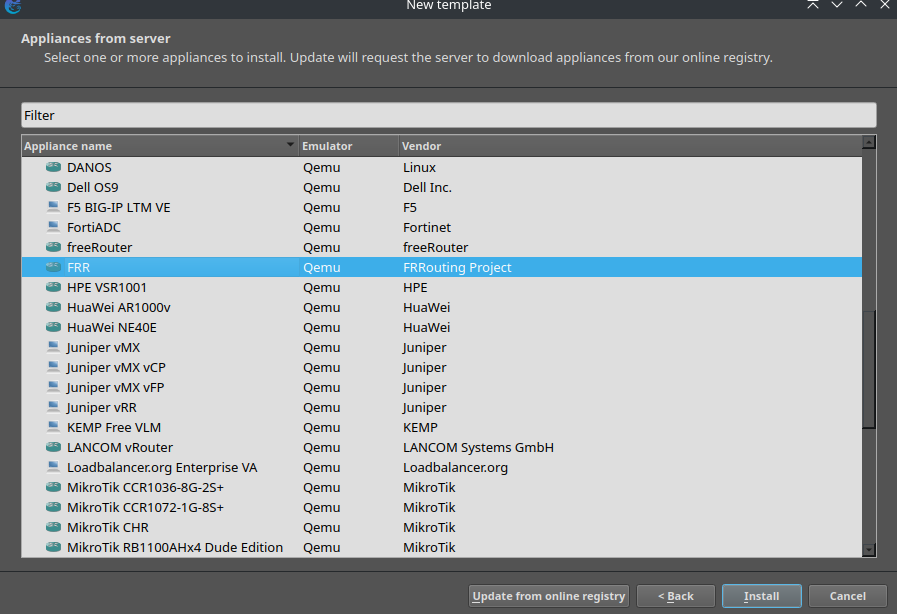
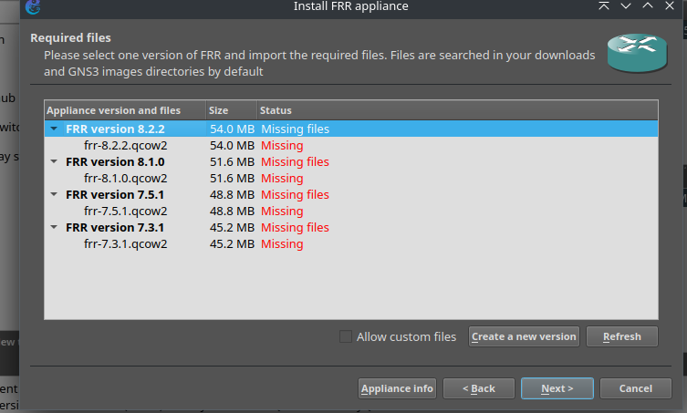
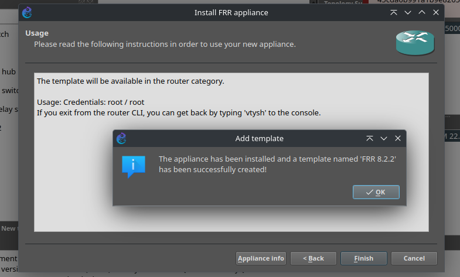
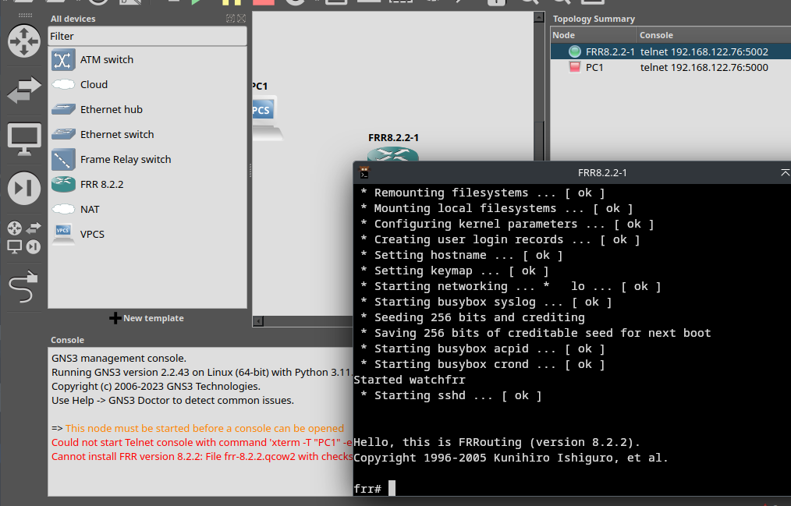
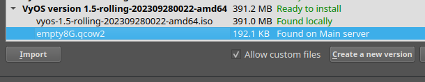

---
## Front matter
title: "Отчет по лабораторной работе 5"
subtitle: ""
author: "Генералов Даниил, НПИбд-01-21, 1032202280"

## Generic otions
lang: ru-RU
toc-title: "Содержание"

## Pdf output format
toc: true # Table of contents
toc-depth: 2
lof: true # List of figures
lot: true # List of tables
fontsize: 12pt
linestretch: 1.5
papersize: a4
documentclass: scrreprt
## I18n polyglossia
polyglossia-lang:
  name: russian
  options:
	- spelling=modern
	- babelshorthands=true
polyglossia-otherlangs:
  name: english
## I18n babel
babel-lang: russian
babel-otherlangs: english
## Fonts
mainfont: PT Serif
romanfont: PT Serif
sansfont: PT Sans
monofont: PT Mono
mainfontoptions: Ligatures=TeX
romanfontoptions: Ligatures=TeX
sansfontoptions: Ligatures=TeX,Scale=MatchLowercase
monofontoptions: Scale=MatchLowercase,Scale=0.9
## Biblatex
biblatex: true
biblio-style: "gost-numeric"
biblatexoptions:
  - parentracker=true
  - backend=biber
  - hyperref=auto
  - language=auto
  - autolang=other*
  - citestyle=gost-numeric
## Pandoc-crossref LaTeX customization
figureTitle: "Рис."
tableTitle: "Таблица"
listingTitle: "Листинг"
lofTitle: "Список иллюстраций"
lotTitle: "Список таблиц"
lolTitle: "Листинги"
## Misc options
indent: true
header-includes:
  - \usepackage{indentfirst}
  - \usepackage{float} # keep figures where there are in the text
  - \floatplacement{figure}{H} # keep figures where there are in the text
---

# Цель работы

> Установка и настройка GNS3 и сопутствующего программного обеспечения.

# Задание

> 1. Установить GNS3-all-in-one, GNS3 VM, проверить корректность запуска (см. раздел 4.3).
> 2. Импортировать в GNS3 образ маршрутизатора FRR (см. раздел 4.4).
> 3. Импортировать в GNS3 образ маршрутизатора VyOS (см. раздел 4.4).

# Выполнение лабораторной работы

Сначала я установил программу GNS3 на свой компьютер.
Для Arch Linux версия GNS3 2.2.43 доступна в AUR.

Одновременно с этим я начал скачивать образ GNS3 VM с GitHub.
Поскольку я работаю на Linux, и у меня уже установлен KVM,
я скачиваю KVM-версию виртуальной машины.

Внутри архива находится образ диска в формате QCOW2,
и скрипт, который создает TAP-интерфейс для виртуальной машины и запускает её.
Я запустил этот скрипт, и GNS3 VM запустилась.

Этот скрипт создал интерфейс и пытался сделать мост с интерфейсом `virbr0`, который должен был существовать для сети виртуальных машин.
Однако я запускал виртуальные машины только в пользовательской сессии KVM, поэтому этого интерфейса не было создано.
Чтобы запустить его, я открыл `virt-manager`, который сообщил мне, что для этого также требуется установить `dnsmasq`, что я дальше сделал.

Теперь GNS3 VM получила IP-адрес, который можно использовать из GNS3 GUI, чтобы подключиться к ней.
Также, GNS3 server version = 2.2.43, что совпадает с тем, что установлено у меня на компьютере

Запустив GNS3 GUI, я настроил его, чтобы использовать как основной сервер не локальный `gns3server`, а тот, который запущен в виртуальной машине.

Для того, чтобы проверить работоспособность сервера,
я создал новый проект и добавил новый VPCS,
к которому я попытался подключиться через Telnet.
Сначала я поменял настройки GNS3, чтобы для Telnet-соединений открывался терминал `kitty`,
но после этого оказалось, что у меня на машине отсутствует `telnet`, который я затем установил из пакета `inetutils`. После этого консоль заработала.

Следующим шагом мы устанавливаем новый Appliance на GNS-сервер -- в частности роутер FRR.

Для того, чтобы установить appliance, нужно скачать образы его виртуальной машины.

После этого appliance становится установленным, и появляется новый template для него.

Настроив template, мы создаем его экземпляр,
и после этого мы можем запустить его и подключиться к его консоли.

Следующим мы добавляем образ VyOS. Для этого сначала скачиваем его с сайта.

Затем мы создаем Appliance из этого образа.
Из-за того, что мы используем nightly-версию,
нужно создать свою версию в GNS.
Для этого нужно взять другую версию, которая основана на ISO-файлах,
и указать другое имя файла.

После этого можно, как раньше, настроить appliance template и добавить и запустить экземпляр.

# Выводы

Я получил опыт работы с ...
