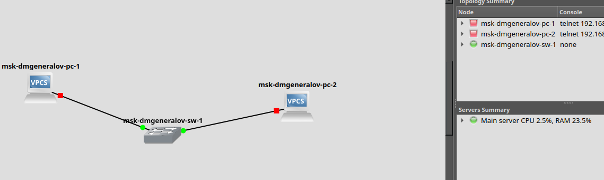
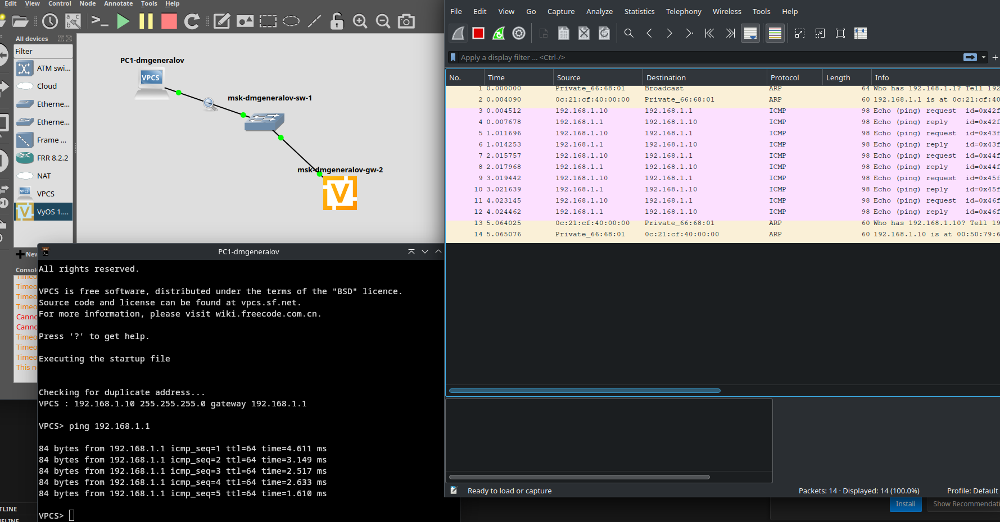

# Задача

> 1. Построить в GNS3 топологию сети, состоящей из коммутатора Ethernet и двух оконечных устройств (персональных компьютеров).
> 2. Задать оконечным устройствам IP-адреса в сети 192.168.1.0/24. Проверить связь.

> 1. С помощью Wireshark захватить и проанализировать ARP-сообщения.
> 2. С помощью Wireshark захватить и проанализировать ICMP-сообщения.

> 1. Построить в GNS3 топологию сети, состоящей из маршрутизатора FRR, коммутатора Ethernet и оконечного устройства.
> 2. Задать оконечному устройству IP-адрес в сети 192.168.1.0/24.
> 3. Присвоить интерфейсу маршрутизатора адрес 192.168.1.1/24
> 4. Проверить связь.

> 1. Построить в GNS3 топологию сети, состоящей из маршрутизатора VyOS, коммутатора Ethernet и оконечного устройства.
> 2. Задать оконечному устройству IP-адрес в сети 192.168.1.0/24.
> 3. Присвоить интерфейсу маршрутизатора адрес 192.168.1.1/24
> 4. Проверить связь.

# Выполнение 

## GNS3

## GNS3

## Ping

## FRR

## FRR

## VyOS

## VyOS

## Вывод

Я получил опыт работы с GNS3 для создания сетей, настройки роутеров и компьютеров,
и анализа пакетов с помощью Wireshark.
