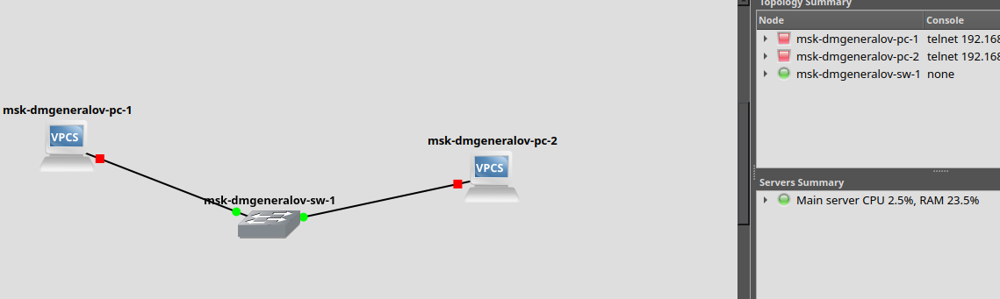
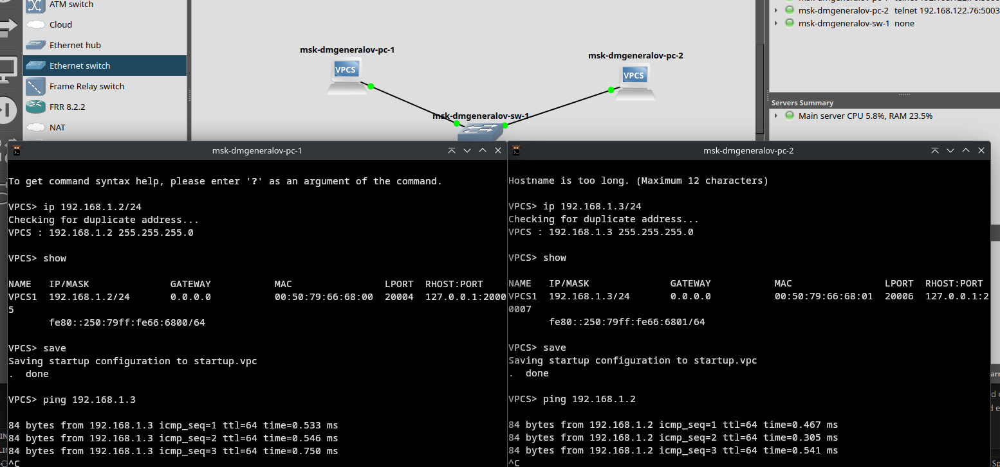
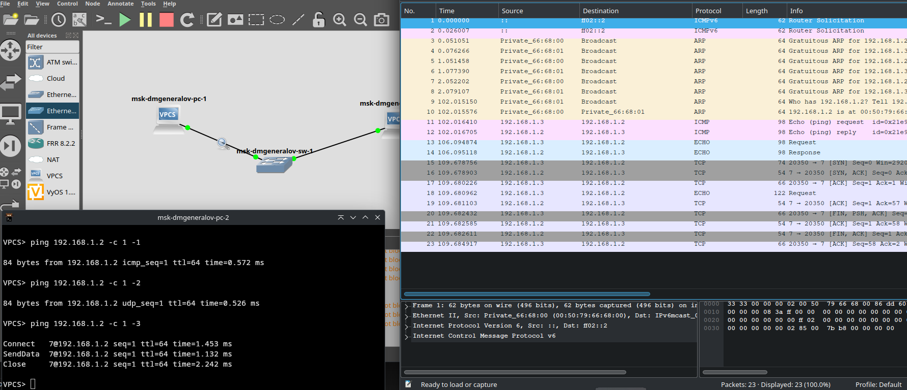
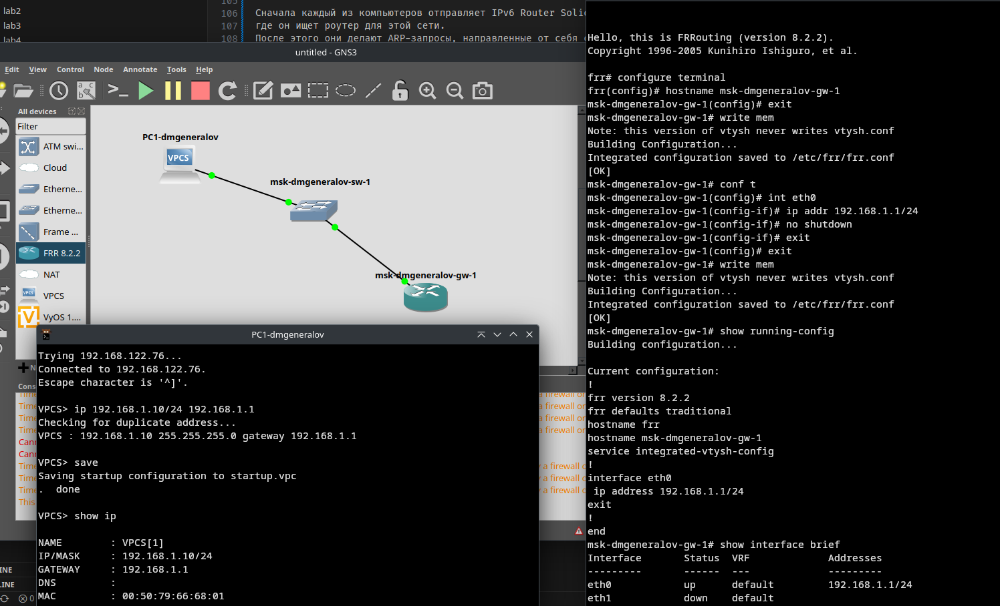
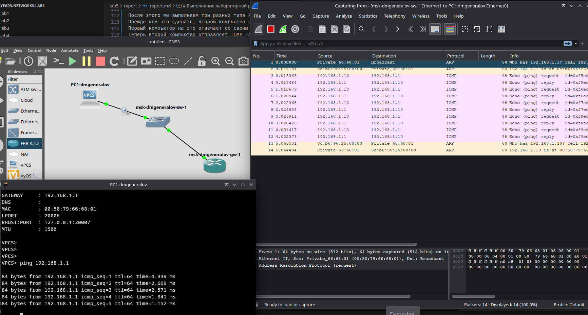
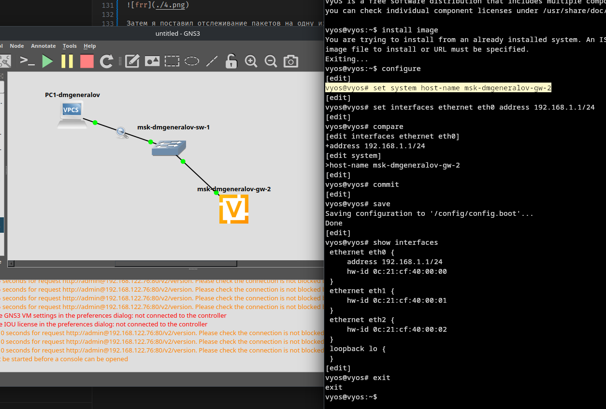
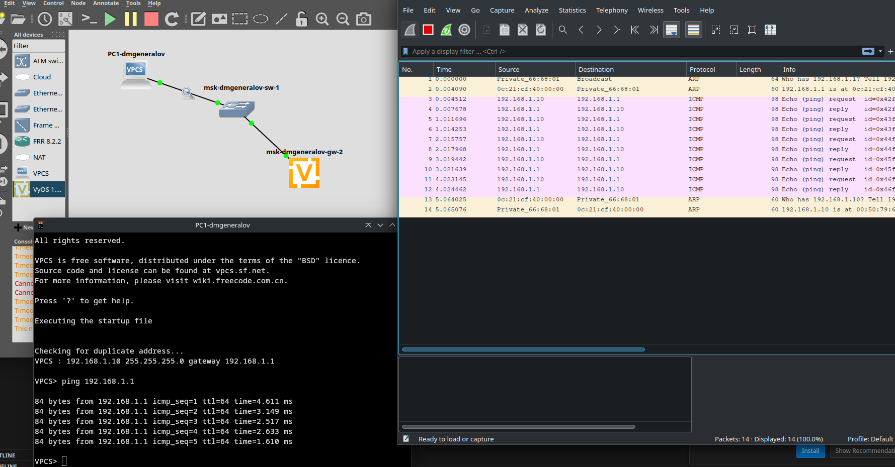

---
## Front matter
title: "Отчет по лабораторной работе 5"
subtitle: ""
author: "Генералов Даниил, НПИбд-01-21, 1032202280"

## Generic otions
lang: ru-RU
toc-title: "Содержание"

## Pdf output format
toc: true # Table of contents
toc-depth: 2
lof: true # List of figures
lot: true # List of tables
fontsize: 12pt
linestretch: 1.5
papersize: a4
documentclass: scrreprt
## I18n polyglossia
polyglossia-lang:
  name: russian
  options:
	- spelling=modern
	- babelshorthands=true
polyglossia-otherlangs:
  name: english
## I18n babel
babel-lang: russian
babel-otherlangs: english
## Fonts
mainfont: PT Serif
romanfont: PT Serif
sansfont: PT Sans
monofont: PT Mono
mainfontoptions: Ligatures=TeX
romanfontoptions: Ligatures=TeX
sansfontoptions: Ligatures=TeX,Scale=MatchLowercase
monofontoptions: Scale=MatchLowercase,Scale=0.9
## Biblatex
biblatex: true
biblio-style: "gost-numeric"
biblatexoptions:
  - parentracker=true
  - backend=biber
  - hyperref=auto
  - language=auto
  - autolang=other*
  - citestyle=gost-numeric
## Pandoc-crossref LaTeX customization
figureTitle: "Рис."
tableTitle: "Таблица"
listingTitle: "Листинг"
lofTitle: "Список иллюстраций"
lotTitle: "Список таблиц"
lolTitle: "Листинги"
## Misc options
indent: true
header-includes:
  - \usepackage{indentfirst}
  - \usepackage{float} # keep figures where there are in the text
  - \floatplacement{figure}{H} # keep figures where there are in the text
---

# Цель работы

> Построение простейших моделей сети на базе коммутатора и маршрутизаторов FRR и VyOS в GNS3, анализ трафика посредством Wireshark.

# Задание

> 1. Построить в GNS3 топологию сети, состоящей из коммутатора Ethernet и двух оконечных устройств (персональных компьютеров).
> 2. Задать оконечным устройствам IP-адреса в сети 192.168.1.0/24. Проверить связь.

> 1. С помощью Wireshark захватить и проанализировать ARP-сообщения.
> 2. С помощью Wireshark захватить и проанализировать ICMP-сообщения.

> 1. Построить в GNS3 топологию сети, состоящей из маршрутизатора FRR, коммутатора Ethernet и оконечного устройства.
> 2. Задать оконечному устройству IP-адрес в сети 192.168.1.0/24.
> 3. Присвоить интерфейсу маршрутизатора адрес 192.168.1.1/24
> 4. Проверить связь.

> 1. Построить в GNS3 топологию сети, состоящей из маршрутизатора VyOS, коммутатора Ethernet и оконечного устройства.
> 2. Задать оконечному устройству IP-адрес в сети 192.168.1.0/24.
> 3. Присвоить интерфейсу маршрутизатора адрес 192.168.1.1/24
> 4. Проверить связь.

# Выполнение лабораторной работы

Сначала я запустил подготовленную в предыдущей лабораторной работе GNS3 VM
и открыл проект в GNS3 UI.
В этом проекте я добавил два устройства VPCS и один Ethernet-свитч, которые соединены между собой.

После этого я включил два VPCS, и на первом задал IP-адрес 192.168.1.2/24, а на втором -- 192.168.1.3/24.
Затем я проверил, что каждый из них может связаться с другим, что оказалось верным, потому что ping-пакеты возвращались.

После этого я выключил все устройства, а затем включил их обратно,
отслеживая пакеты на связи между первым компьютером и свитчем.

Сначала каждый из компьютеров отправляет IPv6 Router Solicitation,
где он ищет роутер для этой сети.
После этого они делают ARP-запросы, направленные от себя себе же --
эти запросы служат для того, чтобы анонсировать свой MAC-адрес и IP-адрес другим устройствам в сети,
а также чтобы обнаружить другие устройства с таким же IP-адресом.

После этого мы выполняем три разных типа Ping: ICMP, UDP и TCP.
Прежде чем это сделать, второй компьютер спрашивает сеть о MAC-адресе компьютера 192.168.1.2, которому он посылает пакет.
Первый компьютер на это отвечает со своим MAC-адресом.
Теперь второй компьютер отправляет ICMP Echo request,
и получает в ответ ICMP Echo Reply.
Аналогичное происходит с UDP: отправляется обычный UDP-пакет на порт 7,
который зарезервирован как Echo порт.
TCP-echo также работает на порту 7.
Однако в этом разговоре первый компьютер просто принял соединение на порту 7
(с помощью стандартного SYN/SYN+ACK/ACK-процесса),
затем получил один пакет внутри этого соединения, отправил на него ACK,
а затем второй компьютер закрыл соединение.

Теперь я заменил один из компьютеров FRR-устройством,
которое я настроил с правильным именем и IP-адресом,
а затем указал этот адрес в настройках VPCS.

Затем я поставил отслеживание пакетов на одну из связей,
и запустил Ping.
Сначала компьютер отправляет ARP-запрос, чтобы найти MAC-адрес 192.168.1.1,
который отвечает ему.
После этого компьютер отправляет ICMP Echo Request,
на которые вскоре после этого приходит ICMP Echo Reply,
что подтверждает, что связь работает.
После того, как компьютер отправляет 5 пингов,
роутер решает спросить его о его MAC-адресе -- возможно потому что роутер теперь считает его важной частью сети,
и хочет быстро отправить в его направлении пакеты, адресованные его MAC-адресу --
и компьютер отвечает на этот запрос.

После этого нужно сделать то же самое, но с роутером на VyOS.
Поэтому я оставляю VPCS и свитч, но удаляю FRR-роутер,
ставлю VyOS-роутер,
затем захожу в его консоль и настраиваю его.
Как предупреждает руководство к лабораторной работе,
изменение имени устройства не применяется до перезагрузки устройства.

После этого мы запускаем Ping с компьютера,
и запись пакетов здесь выглядит идентичной.
Компьютер все так же посылает ARP-запрос,
потому что информация о MAC-адресе могла за это время стать неактуальной
(что и произошло, потому что мы поменяли оборудование),
роутер так же отвечает на Ping-запросы,
а после этого так же осуществляет ARP-поиск этого IP-адреса.

# Выводы

Я получил опыт работы с GNS3 для создания сетей, настройки роутеров и компьютеров,
и анализа пакетов с помощью Wireshark.
