# Задача

> 6.3.1. Разбиение сети на подсети
> 6.3.2. Настройка двойного стека адресации IPv4 и IPv6 в локальной сети
> 6.3.3. Задание для самостоятельного выполнения

# Выполнение 

## GNS

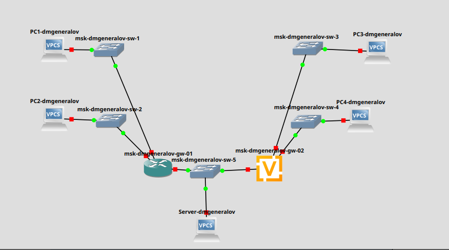

## GNS

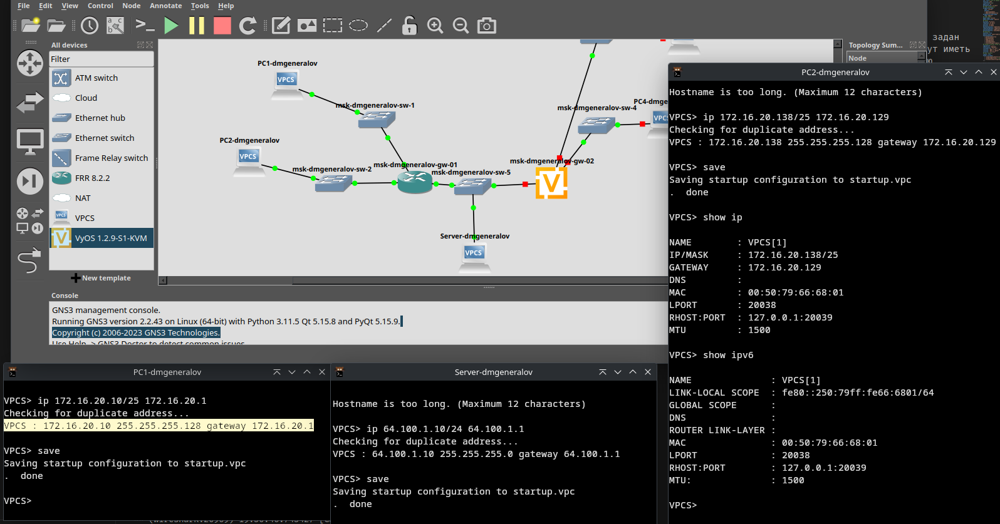

## GNS

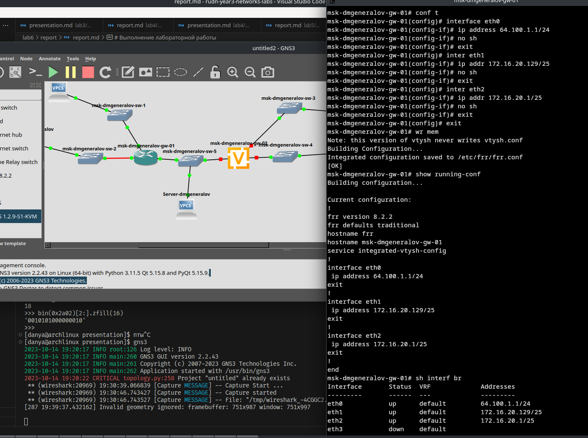

## GNS

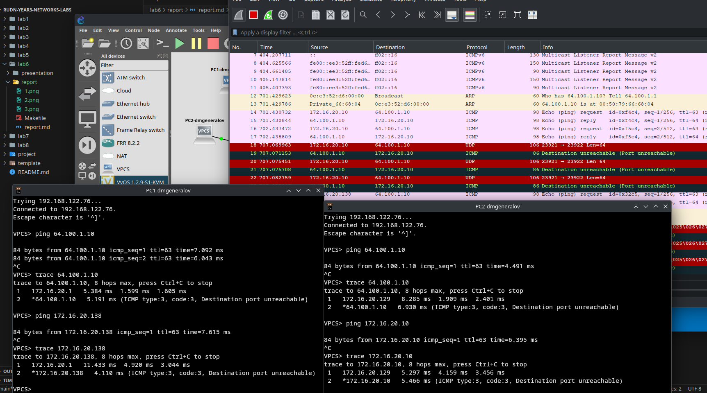

## GNS

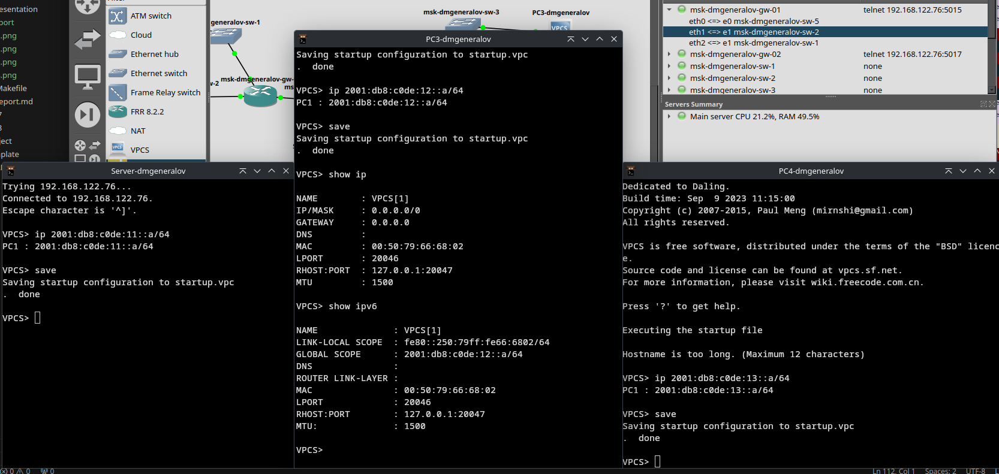

## GNS

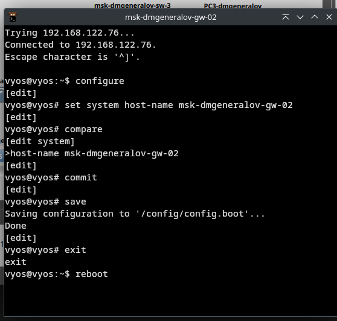

## GNS

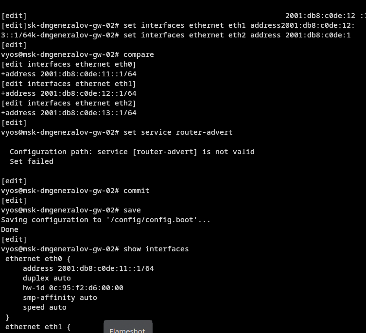

## GNS

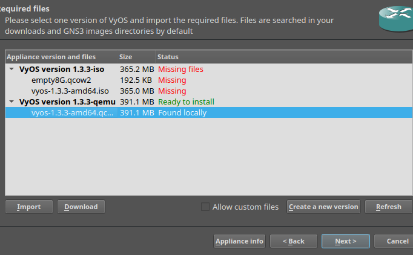

## GNS

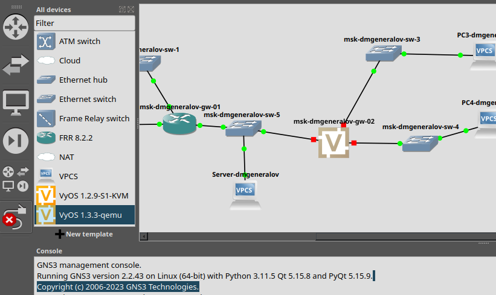

## GNS

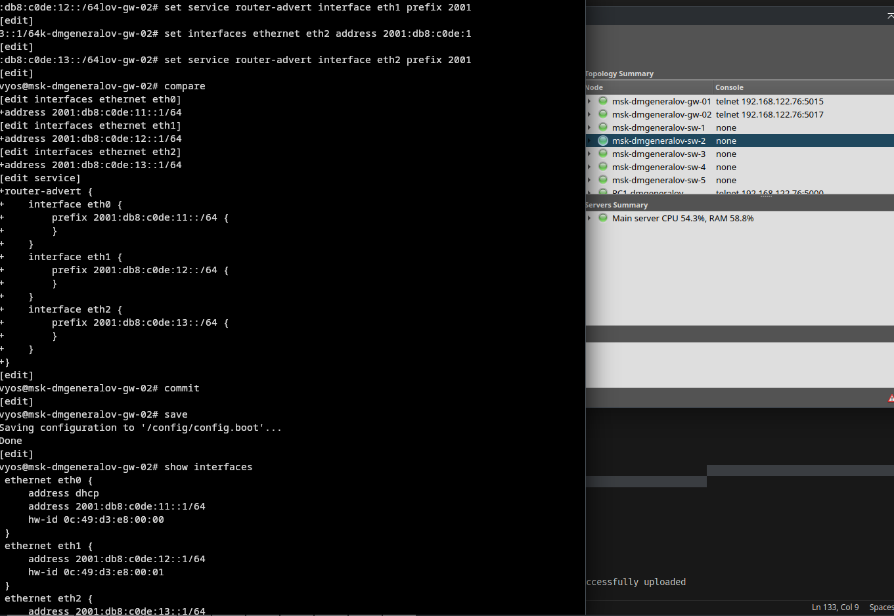

## GNS

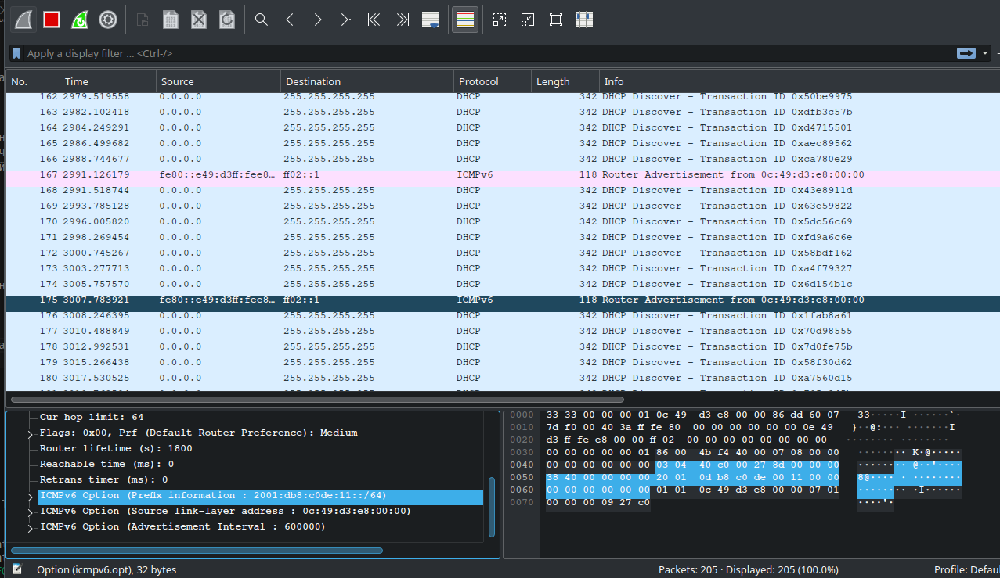

## GNS

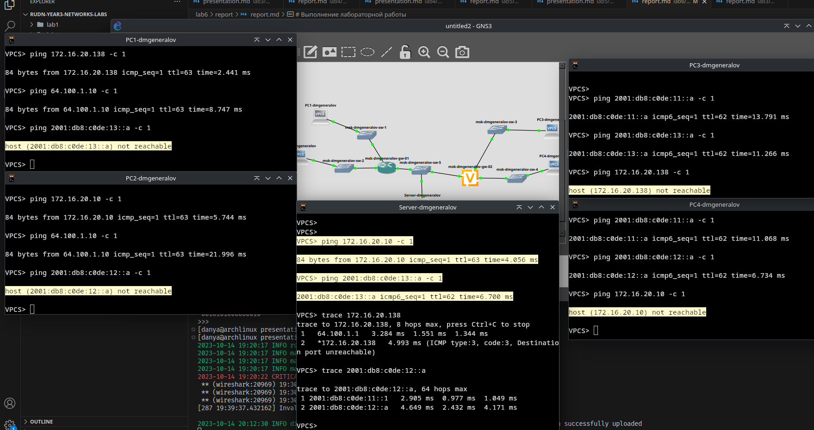

## GNS

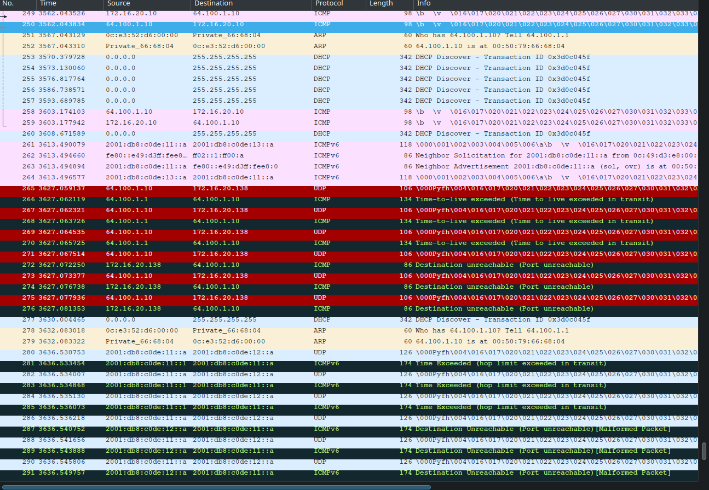

## GNS

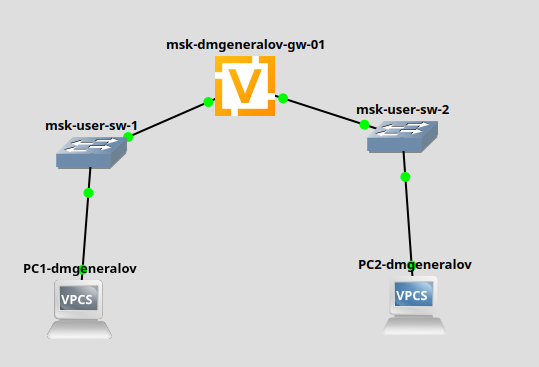

## GNS

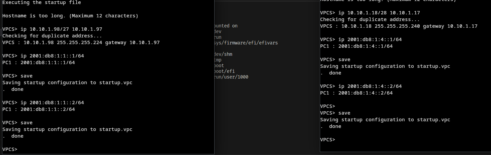

## GNS

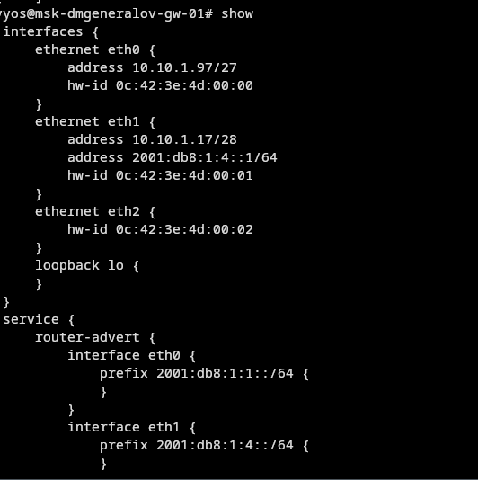

## GNS

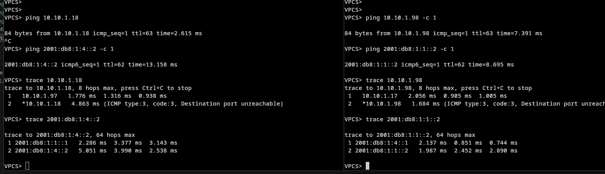

## Вывод

Я получил опыт настройки сетей с протоколом IPv4 и IPv6.
