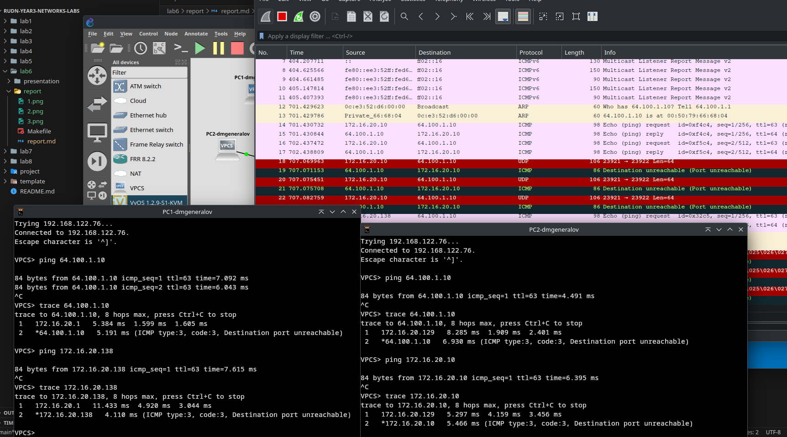
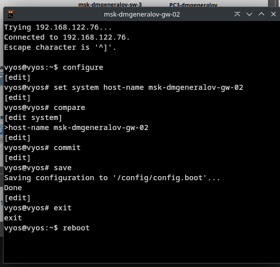
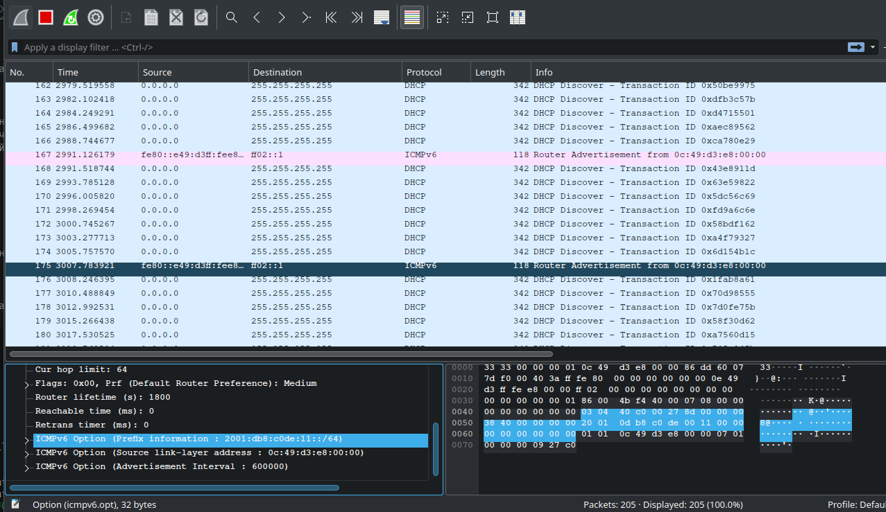
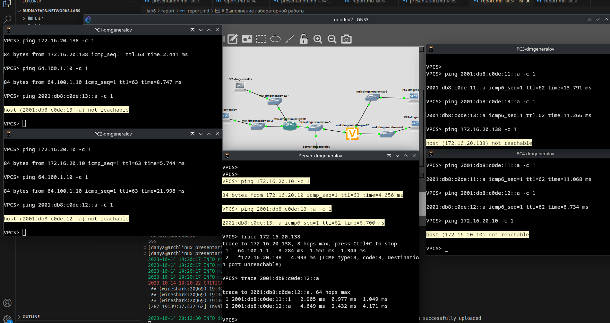
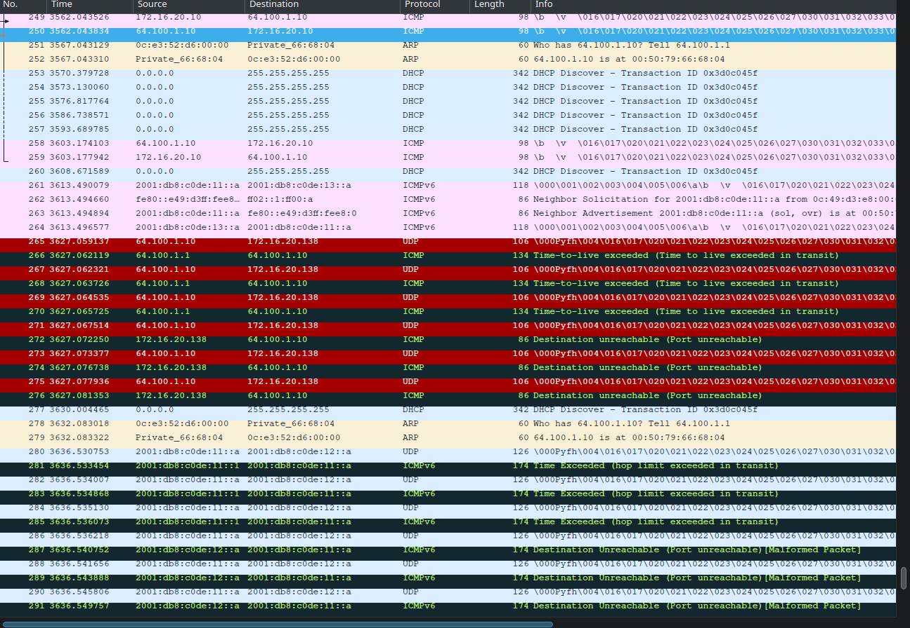

---
## Front matter
title: "Отчет по лабораторной работе 6"
subtitle: ""
author: "Генералов Даниил, НПИбд-01-21, 1032202280"

## Generic otions
lang: ru-RU
toc-title: "Содержание"

## Pdf output format
toc: true # Table of contents
toc-depth: 2
lof: true # List of figures
lot: true # List of tables
fontsize: 12pt
linestretch: 1.5
papersize: a4
documentclass: scrreprt
## I18n polyglossia
polyglossia-lang:
  name: russian
  options:
	- spelling=modern
	- babelshorthands=true
polyglossia-otherlangs:
  name: english
## I18n babel
babel-lang: russian
babel-otherlangs: english
## Fonts
mainfont: PT Serif
romanfont: PT Serif
sansfont: PT Sans
monofont: PT Mono
mainfontoptions: Ligatures=TeX
romanfontoptions: Ligatures=TeX
sansfontoptions: Ligatures=TeX,Scale=MatchLowercase
monofontoptions: Scale=MatchLowercase,Scale=0.9
## Biblatex
biblatex: true
biblio-style: "gost-numeric"
biblatexoptions:
  - parentracker=true
  - backend=biber
  - hyperref=auto
  - language=auto
  - autolang=other*
  - citestyle=gost-numeric
## Pandoc-crossref LaTeX customization
figureTitle: "Рис."
tableTitle: "Таблица"
listingTitle: "Листинг"
lofTitle: "Список иллюстраций"
lotTitle: "Список таблиц"
lolTitle: "Листинги"
## Misc options
indent: true
header-includes:
  - \usepackage{indentfirst}
  - \usepackage{float} # keep figures where there are in the text
  - \floatplacement{figure}{H} # keep figures where there are in the text
---

# Цель работы

> Изучение принципов распределения и настройки адресного пространства на устройствах сети.

# Задание

> 6.3.1. Разбиение сети на подсети
> 6.3.2. Настройка двойного стека адресации IPv4 и IPv6 в локальной сети
> 6.3.3. Задание для самостоятельного выполнения

# Выполнение лабораторной работы

Сначала мы делаем вычисления над подсетями IPv4:

- Для сети 172.16.20.0/24 префикс равен 172.16.20.0, потому что маска подсети равна 255.255.255.0 (24 бита сначала равны 1); broadcast-адрес равен 172.16.20.255 (все биты хоста равны 1), число подсетей `2^24 = 16777216`, а хосты могут иметь адреса от 172.16.20.1 до 172.16.20.254 включительно. Чтобы разбить эту сеть на подсети с 126, 62 и 62 узла, эти сети должны иметь длину префикса 25, 26 и 26 битов соответственно; например, это может быть 172.16.20.0/25 + 172.16.20.128/26 + 172.16.20.192/26.
- Для сети 10.10.1.64/26 префикс равен 10.10.1.64, маска подсети равна 255.255.255.192 (26 битов равны 1); broadcast-адрес -- 10.10.1.127, число подсетей `2^26 = 67108864`, и хосты могут иметь адреса от 10.10.1.65 до 10.10.1.126 включительно. Подсеть этой сети с 30 хостами будет иметь маску длиной 27, например 10.10.1.64/27: здесь, маска подсети равна 255.255.255.224, broadcast-адрес -- 10.10.1.95, а хосты -- от 10.10.1.65 до 10.10.1.94.
- Для сети 10.10.1.0/26 префикс равен 10.10.1.0, маска подсети равна 255.255.255.192 (26 битов равны 1); broadcast-адрес -- 10.10.1.63, число подсетей `2^26 = 67108864`, и хосты могут иметь адреса от 10.10.1.1 до 10.10.1.62 включительно. Подсеть с 14 хостами будет иметь маску длиной 28, например 10.10.1.0/28: здесь, маска подсети равна 255.255.255.240, broadcast-адрес -- 10.10.1.15, а хосты -- от 10.10.1.1 до 10.10.1.14.

После этого мы делаем вычисления над сетями IPv6:

- Сеть 2001:db8:c0de::/48 является подсетью зарезервированной для документации сети (а также одним из глобальных адресов), в которой полностью задан префикс глобальной маршрутизации. Его маска равна ffff:ffff:ffff:: (48 битов сначала равны 1), префикс сети равен 2001:db8:c0de::, и хосты могут иметь адреса от 2001:db8:c0de:0:0:0:0:0 до 2001:db8:c0de:ffff:ffff:ffff:ffff:ffff. Можно выделить две подсети, либо на подсети с маской /64 с помощью идентификатора подсети (например, когда он равен 0 и 1: 2001:db8:c0de:0::/64 и 2001:db8:c0de:1::/64), либо на подсети с маской /68 с помощью первых 4 бит идентификатора интерфейса (например, когда они равны a или b: 2001:db8:c0de:1337:a000::/68 и 2001:db8:c0de:1337:b000::/68).
- Сеть 2a02:6b8::/64 является глобальным адресом, в котором полностью задан префикс глобальной маршрутизации и номер подсети, но не определен интерфейс. Его маска равна ffff:ffff:ffff:ffff:: (64 бита сначала равны 1), префикс сети равен 2a02:6b8:0:0::, и хосты (а именно интерфейсы) могут иметь адреса от 2a02:6b8:0:0:0:0:0:0 до 2a02:6b8:0:0:ffff:ffff:ffff:ffff. Саму эту сеть невозможно разбить с помощью идентификатора подсети, потому что идентификатор подсети находится внутри номера сети; если идентификатор подсети изменить, то получатся адреса вроде 2a02:6b8:0:1337::/64 и 2a02:6b8:0:6942::/64, которые не пересекаются с исходной подсетью. Однако разбить эту подсеть с помощью идентификатора интерфейса можно: например, если выделить для этого 4 бита, то можно выделить подсети 2a02:6b8:0:0:a000::/68 и 2a02:6b8:0:0:b000::/68.

После этого, мы можем приступить к работе в GNS3.
Сначала нужно разместить устройства так, как показано на диаграмме.

Затем я включил половину сети для IPv4 и настроил там IP-адреса.
Из характеристик VPCS видно, что у них есть IPv4-адреса, и только link-local адреса IPv6 (то есть, их нельзя использовать для связи с внешним интернетом, а только с локальной сетью).

После этого я настроил роутер, чтобы он имел правильные IP-адреса на всех интерфейсах, и подтвердил, что они были настроены.

Теперь, два компьютера могут успешно связываться друг с другом и с сервером.
Проверка пути показывает, что все соединения проходят через роутер.

После этого нужно сделать такую же настройку с противоположной стороны сети: два компьютера и сервер должны получить свои IPv6-адреса.
Здесь компьютеры имеют только IPv6 адрес, и поэтому их IPv4-адрес равен 0.0.0.0.

Затем мы запускаем роутер на VyOS и задаем его hostname.

После этого мы настраиваем IP-адреса.
По какой-то причине, на VyOS версии 1.2.9 не работает команда `set service router-advert`.
Кажется, на этой версии эта команда отсутствует, что видно по документации: https://docs.vyos.io/en/crux/configuration/service/index.html

Для того, чтобы это сделать, требуется установить более новую версию, например 1.3.3.

После этого нужно выполнить всю настройку на новом устройстве.

Теперь настройка router advertisements работает, и мы применяем её по указаниям.

Можно теперь увидеть на отслеживаемом соединении, что роутер начал отправлять router advertisement, рекламируя свой маршрут.
Также, либо роутер, либо сервер начали запрашивать DHCPv4-адрес (я не совсем понимаю, почему это происходит).

Теперь сеть полностью работоспособна: компьютеры в IPv4-сети могут связываться друг с другом, и компьютеры в IPv6-сети -- друг с другом,
и сервер может связываться с обоими, но одни не могут связываться с другими.

Все ping, которые взаимодействовали с сервером, можно увидеть на записи пакетов, которые направлены к серверу.
На этом скриншоте видно, как, сначала, роутер отправляет серверу пакет ICMP -- ping-запрос -- затем сервер спрашивает про MAC-адрес роутера через ARP,
получает ответ, затем отправляет ICMP-ответ на ping. После этого, через некоторое время, сервер сам отправляет ICMP-запрос и получает ответ,
а затем ICMPv6-запрос и ответ: это когда я делал ping от сервера.
Наконец, начинаются UDP-пакеты, которые получают ICMP-ответы, сообщающие о проблемах с TTL:
это то, как работает программа traceroute.
Ниже есть еще сообщения, как отправляются пакеты UDP по IPv6, и приходят ответы ICMPv6 -- это тот же самый traceroute, но в IPv6-сеть.
В каждом из этих пакетов будет содержаться IP-адреса связанных устройств и сетей, и из этого можно определить топологию всей сети.

Наконец, требуется создать новую сеть, которая состоит из двух компьютеров и одного роутера на VyOS.
Эти два компьютера будут находиться в разных подсетях IPv4 и IPv6:
компьютер 1 -- в подсети 10.10.1.96/27, где могут быть адреса от 10.10.1.97 до 10.10.1.127 включительно, и 2001:db8:1:1::/64, где могут быть адреса от 2001:db8:1:1:: до 2001:db8:1:1:ffff:ffff:ffff:ffff;
а компьютер 2 -- в подсети 10.10.1.16/28, где IP-адреса от 10.10.1.17 до 10.10.1.31, и 2001:DB8:1:4::/64, где от 2001:DB8:1:4:: до 2001:DB8:1:4:ffff:ffff:ffff:ffff.

Традиционно роутер имеет наименьший адрес в подсети, поэтому на левой стороне он будет иметь адрес 10.10.1.97, а на правой -- 10.10.1.17.
Локальная часть IPv6-адреса у него в обоих случаях будет заканчиваться на единицу.
Компьютеры будут иметь следующий по порядку IP-адрес (10.10.1.98 и 10.10.1.18 и заканчивающийся на двойку).

Роутер затем настраивается с router advertisement и IPv4-адресами.

После этого, ping работает в обе стороны, по обоим протоколам.

# Выводы

Я получил опыт настройки сетей с протоколом IPv4 и IPv6.
